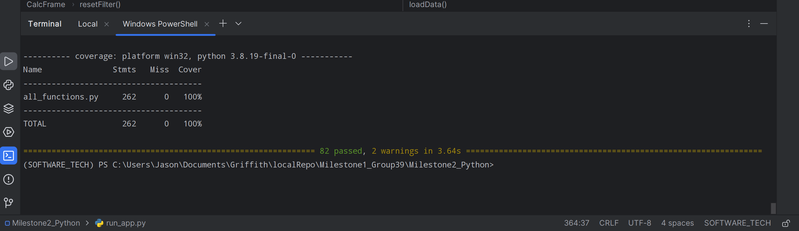
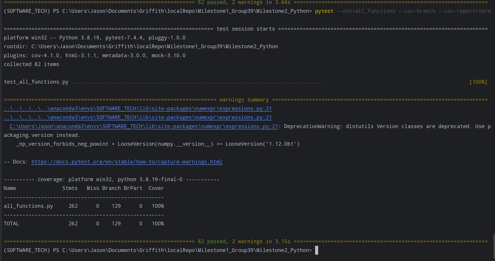

# Coverage Testing Report

[//]: # (Please provide your GitHub repository link.)
### GitHub Repository URL: https://github.com/Volkowo/Milestone1_Group39.git

---

[//]: # (The testing report should focus solely on <span style="color:red"> testing all the self-defined functions related to the five required features.</span> There is no need to test the GUI components. Therefore, it is essential to decouple your code and separate the logic from the GUI-related code.)

[//]: # ()
[//]: # ()
[//]: # (You should perform statement coverage testing and branch coverage testing. For each type, provide a description and an analysis explaining how you evaluated the coverage.)

## 1. **Test Summary**
list all tested functions related to the five required features, for example:

| **Tested Functions**        |
|-----------------------------|
| `loadCSVFile()`             |
| `loadData()`                |
| `findNutritionValue()`      |
| `findResult_generic()`      |
| `findResult_breakdown()`    |
| `findResult_keto()`         |
| `findResult_sodium()`       |
| `findResult_cholesterol()`  |
| `filterDiet()`              |
| `getLabelPieBar()`          |
| `createLabel()`             |
| `concatBarX()`              |
| `checkDropdownAndInput_value()` |
| `filterRange()`             |
| `generateErrorMessage_value()` |
| `checkRadioAndDropdown_level()` |
| `checkResult()`             |
| `filterLevel()`             |
| `mergeResult_filterRange()`  |
| `mergeResult_everything()`   |
| `checkDiet()`               |
| `checkRadio()`              |
| `errorChecking_filters()`    |
| `processFinalResult()`       |
| `determineFoodSearch()`      |


---

## 2. **Statement Coverage Test**

### 2.1 Description
To achieve 100% statement coverage, we designed the test cases to ensure that every line of code will be executed at least once. This means every scenario, including edge cases, needs to be considered to ensure that no statement in the function is skipped. Majority of the test cases have varied input types as a way to cover every branch and ensure that each line of code is tested under a different conditions.\
For example, in the mergeResult_everything() function, we created test cases that ensure every line of the function is executed. If a dataframe is empty, the lines responsible for merging would normally be skipped. However, the searchResult_diet() function always returns a non-empty array regardless of the input, meaning the test cases had to account for that and ensure that every condition and statement within the function was executed. That test case specifically demonstrates how we structured our tests to ensure comprehensive statement coverage across the project.\
Additionally, we also ran the command that lets us print coverage reports into a `.html` files. By looking through the report for statement coverage, we can identify any untested lines that we missed and adjust the test cases accordingly. By considering all code paths and reviewing the coverage report, we were able to reach 100% coverage.


### 2.2 Testing Results

[//]: # (You can use the following command to run the statement coverage test and generate the report in the terminal. Afterward, include a screenshot of the report. )

[//]: # ()
[//]: # (You must provide the test_all_functions.py file, which contains all test functions, otherwise pytest will not be able to execute the tests.)

[//]: # ()
[//]: # (```commandline)

[//]: # (pytest --cov=all_functions --cov-report=term)

[//]: # (```)

[//]: # (Note: In the command above, the file/module `all_functions` does not include the .py extension. all_functions.py should contain all the tested functions related to the five required features.)



## 3. **Branch Coverage Test**

### 3.1 Description
To achieve 100% branch coverage, we created each test cases by following through each function's logical flow and decision points, such as if statements and loops. This is to ensure that every line of code was executed at least once, especially for codes with nested if statements and loops, which are common in our functions. Covering both valid and invalid outcomes ensures that the coverage is comprehensive and detailed. \
For example, in the `filterDiet()` function, there are multiple decision points that are based on the diet type `(if dropdownValue == "Ketogenic Diet", if dropdownValue == "Low Sodium Diet")`. When making the test case for this function, we consider every possible diet type to ensure that all if statements are executed. This also includes handling edge case such as choosing the option `"Dierary Needs"`\
Additionally, we also tested the software manually by interacting with the GUI. This was done in order to find edge cases and ensure that all possible conditions have been tested thoroughly. The reason we need to consider edge cases is to prevent any unexpected inputs and potential bugs in the software. \
Similar with statement coverage, we also ran the command that lets us print coverage reports into an `.html` file. By analyzing through the report, we can confirm whether all branches had been executed at least once and tell which branches we might miss during the initial testing. By combining all of these together, we were able to reach 100% coverage.

### 3.2 Testing Results

[//]: # (You can use the following command to run the branch coverage test and generate the report in the terminal. Afterward, include a screenshot of the report. )

[//]: # ()
[//]: # (You must provide the test_all_functions.py file, which contains all test functions, otherwise pytest will not be able to execute the tests.)

[//]: # ()
[//]: # (```commandline)

[//]: # (pytest --cov=all_functions --cov-branch --cov-report=term)

[//]: # (```)

[//]: # (Note: In the command above, the file/module `all_functions` does not include the .py extension. all_functions.py should contain all the tested functions related to the five required features.)


