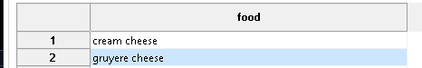
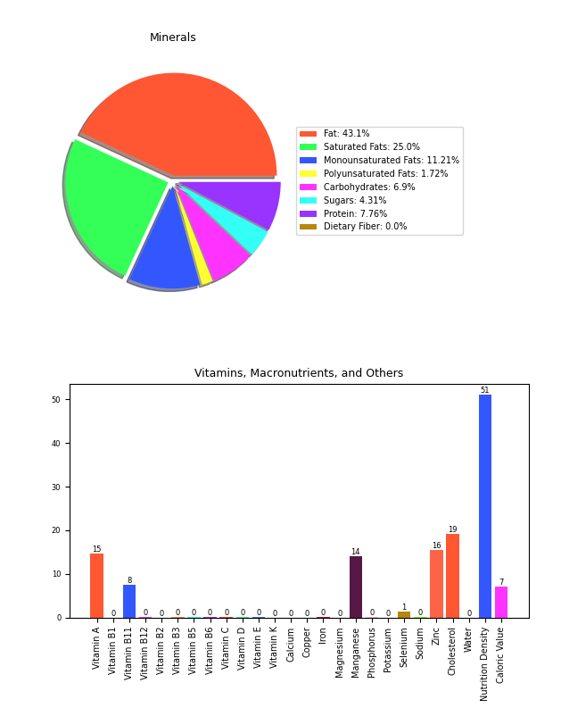
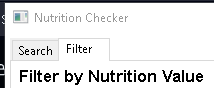
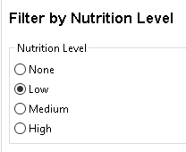
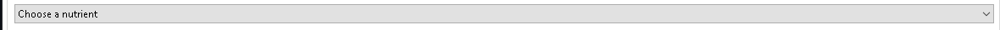
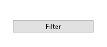
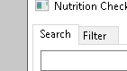
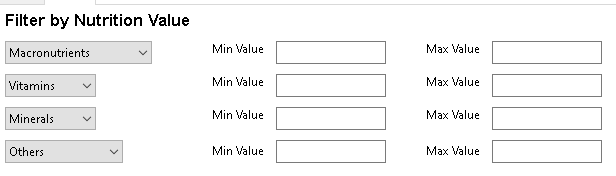
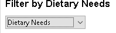

# Executive Summary

Please provide your GitHub repository link.
### GitHub Repository URL: https://github.com/Volkowo/Milestone1_Group39.git

---

You should use your software to prepare an executive summary as outlined below for the five required features.

## 1. Food Search
### Description  
Enable users to search for foods by name and display all the nutritional information;

### Steps
1. Enter name of food item into provided text box.
2. press the search button nect to the text input to search food item.

### Screenshots
step 1

step 2

## 2. Nutrition Breakdown
### Description  
Enable users to select one food, and display pie charts & bar graphs showing the breakdown of different nutrients for the selected food.

### Steps
1. Select a food item from the list of food items.
2. brows the pie chart and bar graph.

### Screenshots
step 1

step 2

---

## 3. Nutrition Level Filter
### Description  
Enable users to filter foods by nutritional content levels—low, mid, and high—including fat, protein, carbohydrates, sugar, and nutritional density.

### Steps
1. Navigate to the filter page.
2. Select a level to filter by.
3. Select a nutrient to be filtered.
4. Press the filter button.
5. Navigate to the search page to see results.

### Screenshots
step 1

step 2

step 3

step 4

step 5

---

## 4. Nutrition Range Filter
### Description  
Enable users to select one of nutrition and input minimum & maximum values, and the tool will display a list of foods that fall within those ranges

### Steps
1. Navigate to the filter page.
2. Set what values you wish to filter using ethr one or more options and set the values for the min and max for thoes options
3. Press the filter button.
4. Navigate to the search page to see results.
### Screenshots
step 1

step 2

step 3

step 4

---

## 5. Dietary Filter
### Description  
Enable users to filter foods based on the three dietary needs that the software have provided.

### Steps
1. Navigate to the filter page.
2. Add additional steps as needed.
3. Press the filter button.
4. Navigate to the search page to see results.

### Screenshots
step 1

step 2

step 3

step 4

---

---
