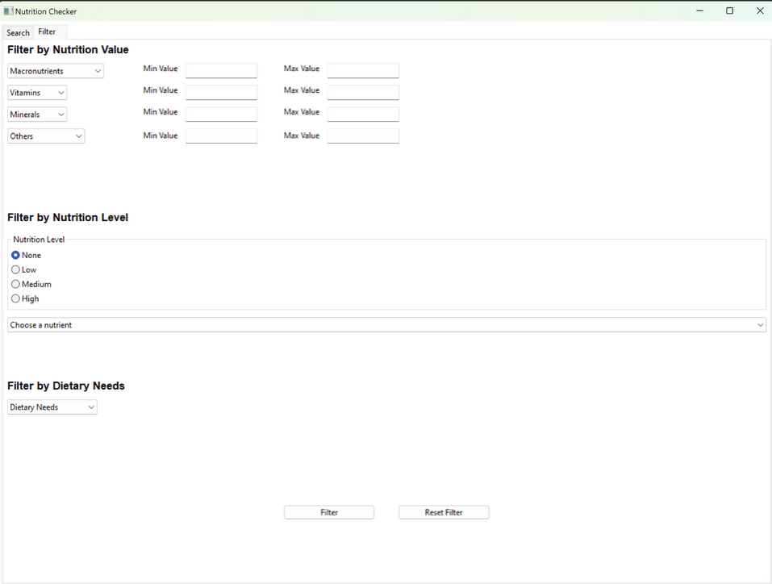
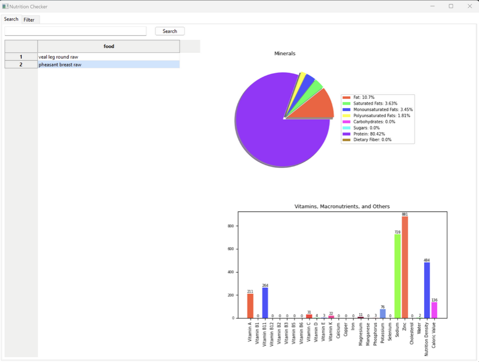

# Executive Summary

### GitHub Repository URL: https://github.com/Volkowo/Milestone1_Group39.git

---

<!-- You should use your software to prepare an executive summary as outlined below for the five required features. -->

## 1. Food Search
### Description  
Enable users to search for foods by name and display all the results in the table. 

### Steps
1. Enter name of food item into the provided text box.
2. Press the search button nect to the text input to search.

### Screenshots
step 1

step 2

## 2. Nutrition Breakdown
### Description  
Enable users to select a food, and visualize the nutrition breakdown with pie charts & bar graphs.

### Steps
1. Select a food from the list of food items in the table.
2. The software will show the pie chart and bar graph on the right side of the page.

### Screenshots
step 1

step 2

---

## 3. Nutrition Level Filter
### Description  
Enable users to filter foods by nutritional content levels—low, mid, and high.
The three levels are defined as follows:
- Low: Less than 33% of the highest value.
- Mid: Between 33% and 66% of the highest value.
- High: Greater than 66% of the highest value.

### Steps
1. Navigate to the filter page.
2. Select a level to filter and nutrient to be filtered with.
3. Press the filter button.
4. Navigate to the search page to see results.

### Screenshots
Step 1

Step 2

Step 3

Step 4

---

## 4. Nutrition Range Filter
### Description  
Enable users to select one of the nutrition and input minimum & maximum values. 

### Steps
1. Navigate to the filter page.
2. Set what nutrients you wish to filter with and set the values for the minimum and maximum range for thoes nutrients.
3. Press the filter button.
4. Navigate to the search page to see results.
### Screenshots
step 1

step 2

step 3

step 4

---

## 5. Dietary Filter
### Description  
Enable users to filter foods based on the three dietary needs that the software have provided.
The requirements for these dietary needs are defined as follow:
- Ketogenic (Keto) Diet \
Low in carbohydrates, which is less than 5-10% of caloric intake.
- Low Sodium Diet \
Foods with low sodium content, which usually is less than 40mg per serving.\

- Low Cholesterol Diet \
Low cholestrol foods that have less than 20mg per serving. \

### Steps
1. Navigate to the filter page.
2. Select the dropdown menu below "Filter by Dietary Needs" to choose which diet to filter the food with..
3. Press the filter button.
4. Navigate to the search page to see results.

### Screenshots
step 1

step 2

step 3

step 4

---

