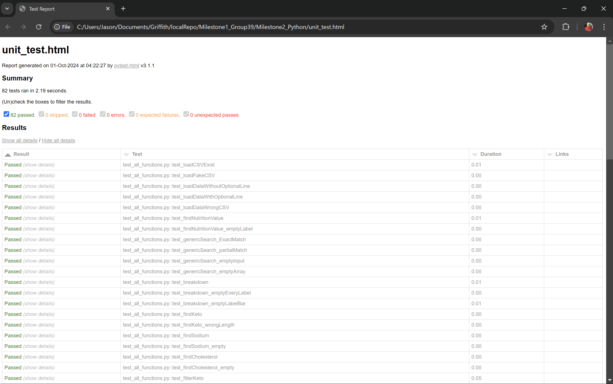

# Unit Testing Report

Please provide your GitHub repository link.
### GitHub Repository URL: https://github.com/Volkowo/Milestone1_Group39.git

---

The testing report should focus solely on <span style="color:red"> testing all the self-defined functions related to 
the five required features.</span> There is no need to test the GUI components. Therefore, it is essential to decouple your code and separate the logic from the GUI-related code.


## 1. **Test Summary**

[//]: # (list all tested functions related to the five required features and the corresponding test functions designed to test )

[//]: # (those functions, for example:)

| **Tested Functions**                                                                                                                                                                          | **Test Functions**                                                                                                                                                                                                      |
|-----------------------------------------------------------------------------------------------------------------------------------------------------------------------------------------------|-------------------------------------------------------------------------------------------------------------------------------------------------------------------------------------------------------------------------|
| `loadCSV(filepath)`                                                                                                                                                                           | `test_loadCSVExist()` <br> `test_loadFakeCSV()`                                                                                                                                                                         |
| `loadData(file, optionalLine=False)`                                                                                                                                                          | `test_loadDataWithoutOptionalLine()` <br> `test_loadDataWithOptionalLine()` <br> `test_loadDataWrongCSV()`                                                                                                              |
| `findNutritionValue(labelAll, dataFrame)`                                                                                                                                                     | `test_findNutritionValue()`                                                                                                                                                                                             |
| `findResult_generic(searchInput, array, items)`                                                                                                                                               | `test_genericSearch_ExactMatch()` <br> `test_genericSearch_partialMatch()` <br> `test_genericSearch_emptyInput()`                                                                                                       |
| `findResult_breakdown(allLabel, labelBar, searchResult)`                                                                                                                                      | `test_breakdown()`                                                                                                                                                                                                      |
| `findResult_keto(carbo, calorie, array)`                                                                                                                                                      | `test_findKeto()`                                                                                                                                                                                                       |
| `findResult_sodium(items, array)`                                                                                                                                                             | `test_findSodium()`                                                                                                                                                                                                     |
| `findResult_cholesterol(items, array)`                                                                                                                                                        | `test_findCholesterol()`                                                                                                                                                                                                |
| `filterDiet(dropdownValue)`                                                                                                                                                                   | `test_filterKeto()` <br> `test_filterSodium()` <br> `test_filterCholesterol()` <br> `test_filterNone()`                                                                                                                 |
| `getLabelPieBar(macronutrients, vitamins, minerals, others)`                                                                                                                                  | `test_getLabelNotEmpty()` <br> `test_getLabelEmpty()`                                                                                                                                                                   |
| `createLabel(arrayPie, labelPie)`                                                                                                                                                             | `test_createLabel()`                                                                                                                                                                                                    |
| `concatBarX(arrayValue)`                                                                                                                                                                      | `test_concatBarX()`                                                                                                                                                                                                     |
| `checkDropdownAndInput_value(dropdownArray, minArray, maxArray, isError, searchResultArray)`                                                                                                  | `test_checkDAI_defaultDropdownAndFilledInput()` <br> `test_checkDAI_diffDropdownAndEmptyInput()` <br> `test_checkDAI_diffDropdownAndAlphaInput()` <br> `test_checkDAI_minGreaterMax()` <br> `test_checkDAI_correct()`   |
| `filterRange(dropdownArrayIndex, minValueIndex, maxValueIndex, searchResult_filter)`                                                                                                          | `test_filterRange()`                                                                                                                                                                                                    |
| `generateErrorMessage_value(nutrientError, inputError, comparisonError))`                                                                                                                     | `test_GEM_nutrient()` <br> `test_GEM_input()` <br> `test_GEM_comparison()` <br> `test_GEM_nutrientAndInput()` <br> `test_GEM_nutrientAndComparison()` <br> `test_GEM_inputAndComparison()` <br> `test_GEM_everyError()` |
| `checkRadioAndDropdown_level()`                                                                                                                                                               | `test_checkRAD_radio()` <br> `test_checkRAD_dropdown()` <br> `test_checkRAD_noError()`                                                                                                                                  |
| `checkResult(radioValue, dropdownValue)`                                                                                                                                                      | `test_checkResult_notEmpty()` <br> `test_checkResult_empty()`                                                                                                                                                           |
| `filterLevel(maxValueDict, dropdownValue, levelFilter)`                                                                                                                                       | `test_filterLevel_low()` <br> `test_filterLevel_medium()` <br> `test_filterLevel_high()`                                                                                                                                |
| `mergeResult_filterRange(searchResultArray_value)`                                                                                                                                            | `test_mergeResult_moreThanOne()` <br> `test_mergeResult_one()`                                                                                                                                                          |
| `mergeResult_everything(searchResult_value, searchResult_level, searchResult_diet)`                                                                                                           | `test_ME_emptyValue()` <br> `test_ME_emptyDiet()` <br> `test_ME_emptyLevel()` <br> `test_ME_everything()` <br> `test_ME_noValue()`                                                                                      |
| `checkDiet(dietDropdown)`                                                                                                                                                                     | `test_CD_default()` <br> `test_CD_keto()` <br> `test_CD_sodium()` <br> `test_CD_cholesterol()`                                                                                                                          |
| `checkRadio(radioValue)`                                                                                                                                                                      | `test_CR_default()` <br> `test_CR_low()` <br> `test_CR_medium()` <br> `test_CR_high()`                                                                                                                                  |
| `errorChecking_filters(isError_filterValue, isError_filterLevel, searchResultArray_value, maxValueDict, nutrientFilter, nutritionLevel, diet)`                                                | `test_ECF_errorLevel()` <br> `test_ECF_errorFilter()` <br> `test_ECF_onlyDiet()` <br> `test_ECF_noError()`                                                                                                              |
| `processFinalResult(searchResult_valueFinal, searchResult_level, searchResult_diet, errorMessages, defaultDropdown, dropdownArray, minArray, maxArray, nutritionLevel, nutrientFilter, diet)` | `test_processFinalResult_noError()` <br> `test_processFinalResult_error()` <br> `test_processFinalResult_reset()`                                                                                                       | 


---

## 2. **Test Case Details**

### Test Case 1:
- **Test Function/Module**
  - `test_loadCSVExist()`
  - `test_loadFakeCSV()`
- **Tested Function/Module**
  - `loadCSVFile(filepath)`
- **Description**
  - Brief Description:\
  The function will attempt to read and load the csv file.
  - Input:
    - Path to the .csv file.
  - Output:
    - The csv file being read by pandas
- **1) Valid Input and Expected Output**  

| **Valid Input**               | **Expected Output**           |
|-------------------------------|-------------------------------|
| `loadCSV(r".\Food_Nutrition_Dataset.csv")`               | The file being read by pandas |

- **1) Code for the Test Function**
```python
def test_loadCSVExist():                          
    wineData = loadCSVFile(r".\Food_Nutrition_Data
    assert isinstance(wineData, pd.DataFrame)     
```
- **2) Invalid Input and Expected Output**

| **Invalid Input**        | **Expected Output**                            |
|--------------------------|------------------------------------------------|
| `divide(r"./fictionalCSV.csv")`               | Exception with the message `"File not found."` |

- **2) Code for the Test Function**
```python
def test_loadFakeCSV(file, optionalLine=False):                               
    with pytest.raises(Exception) as exc_info:        
        loadCSVFile(r"./fictionalCSV.csv")              
```
### Test Case 2:
- **Test Function/Module**
  - `test_loadDataWithoutOptionalLine()`
  - `test_loadDataWithOptionalLine()`
- **Tested Function/Module**
  - `loadData(file, optionalLine=False)`
- **Description**
    - Brief Description:\
    The function will load the CSV file and then converts it into a dataframe. optionalLine determines the amount of columns that will be returned.
  - Input:
    - **file**: Path to the .csv file.
    - **optionalLine**: True or False. Default value is false
  - Output:
    - DataFrame
- **1) Valid Input and Expected Output**  

| **Valid Input**               | **Expected Output**                           |
|-------------------------------|-----------------------------------------------|
| `loadData(r".\Food_Nutrition_Dataset.csv", False) `               | Dataframe with every column in said .csv file |
| `loadData(r".\Food_Nutrition_Dataset.csv", True) `              | Dataframe with only the column "food" .       |

- **1) Code for the Test Function**
```python
def test_loadDataWithoutOptionalLine():
    # This means that every column is gonna be included in the table
    dataFrame = loadData(r".\Food_Nutrition_Dataset.csv", False)
    assert "Fat" in dataFrame.columns 
```
```python
def test_loadDataWithOptionalLine():
    dataFrame = loadData(r".\Food_Nutrition_Dataset.csv", True)
    assert "food" in dataFrame.columns and "Vitamin B1" not in dataFrame.columns
```

- **2) Invalid Input and Expected Output** \
It is important to note that error handling for this is handled through the function loadData().

| **Invalid Input**               | **Expected Output** |
|---------------------------------|---------------------|
| `loadData(r".\bruh.csv", True)` |  Exception with the message `"File not found."` |

- **2) Code for the Test Function**
```python
def test_loadDataWrongCSV():
    with pytest.raises(Exception) as exc_info:
        dataFrame = loadData(r"./fictionalCSV.csv")
```

### Test Case 3:
- **Test Function/Module**
  - `test_findNutritionValue()`
- **Tested Function/Module**
  - `findNutritionValue(labelAll, dataFrame)`
- **Description**
  - Brief Description:\
    The function will find the maximum value for each nutrient and put them into a dictionary.\
    The keys are the nutrient, while the values are the maximum value.
  - Input:
    - **labelAll**: List. Contains the name of every nutrient.
    - **dataFrame**: dataframe. The dataframe file that will be used to find the values.
  - Output:
    - Dictionary
- **1) Valid Input and Expected Output** \
In the actual software, labelAll and dataFrame are already defined before running this function.

| **Valid Input**                           | **Expected Output**            |
|-------------------------------------------|--------------------------------|
| `findNutritionValue(labelAll, dataFrame)` | A dictionary that is not empty |

- **1) Code for the Test Function**
```python
def test_findNutritionValue():
    dataFrameForDict = loadData(r"Food_Nutrition_Dataset.csv")
    maxDict = findNutritionValue(allLabel, dataFrameForDict)

    # Iterate through every key value in the dictionary to find if there is any empty (or "") values
    for key in maxDict.keys():
        assert maxDict[key] is None or maxDict[key] != ""
```
- **2) Invalid Input and Expected Output** \
Errors in loading the CSV data are handled through the function loadCSVFile(), which is inside the function loadData(). Because of this, Testing for incorrect CSV files in this function, as those scenarios are already covered by the error handling implemented in loadCSVFile().

| **Invalid Input**                     | **Expected Output**                                      |
|---------------------------------------|----------------------------------------------------------|
| `findNutritionValue([], dataFrame)`)` | ValueError with the message `This array cannot be empty` |

- **2) Code for the Test Function**
```python
def test_findNutritionValue_emptyLabel(): # NEW TESTCASE
    dataFrameForDict = loadData(r"Food_Nutrition_Dataset.csv")

    with pytest.raises(ValueError) as exc_info:
        maxDict = findNutritionValue([], dataFrameForDict)
```

### Test Case 4:
- **Test Function/Module**
  - `test_genericSearch_ExactMatch()`
  - `test_genericSearch_partialMatch()`
  - `test_genericSearch_emptyInput()`
  - `test_genericSearch_emptyArray()`
- **Tested Function/Module**
  - `findResult_generic(searchInput, array, items)`
- **Description**
  - Brief Description:\
    The function will try and find item(s) that have matching string with searchInput.
  - Input:
    - **searchInput**: string. The user's input.
    - **array**: List. The array where the result will be stored.
    - **items**: List. The iterated array which contains a list of items.
  - Output:
    - List
- **1) Valid Input and Expected Output**  

| **Valid Input**                                    | **Expected Output**                                          |
|----------------------------------------------------|--------------------------------------------------------------|
| `findResult_generic("Apricot Jam", foodAray)` | A list containing food(s) that has "Apricot Jam" in its name |
| `findResult_generic("", foodAray)`           | A list that returns every food in the original dataframe     |
| `findResult_generic("Cheese", foodAray)`    | A list containing food(s) with "cheese" in its name          |

- **1) Code for the Test Function**
```python
def test_genericSearch_ExactMatch():
    results = findResult_generic("Apricot Jam", foodArray)
    assert sum(results) == 1

def test_genericSearch_partialMatch():
    results = findResult_generic("Cheese", foodArray)
    assert sum(results) == 47

def test_genericSearch_emptyInput():
    results = findResult_generic("", foodArray)
    assert sum(results) == len(foodArray)
```
- **2) Invalid Input and Expected Output**

| **Invalid Input**             | **Expected Output** |
|-------------------------------|---------------------|
| `findResult_generic("Cheese", results, [])`               | An empty array      |

- **2) Code for the Test Function**
```python
def test_genericSearch_emptyArray(): # NEW TESTCASE
    results = []
    findResult_generic("Cheese", results, [])
    assert not results
```


### Test Case 5:
- **Test Function/Module**
  - `test_breakdown()`
  - `test_breakdown_emptyAllLabel()`
  - `test_breakdown_emptyEveryLabel()`
  - `test_breakdown_emptyLabelBar()`
  - `test_breakdown_emptySearchResult()`
- **Tested Function/Module**
  - `findResult_breakdown(allLabel, labelBar, searchResult)`
- **Description**
  - Brief Description:\
    This function is one of the function that runs when displaying the nutritional breakdown as charts. \
    The function will sort allLabel, which contains the name of every nutrient, into two arrays: barArray and pie Array. These two arrays will be used as the charts' labels.\
    labelBar lists all the nutrient that should go into barArray.
  - Input:
    - **allLabel**: List. Contains the name of every nutrient from the .csv file.
    - **labelBar**: List. The list of nutrients that should go into barArray.
    - **searchResult**: Dataframe. Contains the all the relevant information for the food that the user clicked.
  - Output:
    - 2 Arrays
- **1) Valid Input and Expected Output**  \
In the actual software, allLabel, labelBar, and searchResult are defined before this function runs. The valid input is under the assumption that each variable have the appropriate values.

| **Valid Input**                                    | **Expected Output**              |
|----------------------------------------------------|----------------------------------|
| `test_breakdown(allLabel, labelBar, searchResult)` | 2 lists with elements inside it. |

- **1) Code for the Test Function**
```python
def test_breakdown():
    # Simulate the act of user clicking on a food name in the table.
    dataFrame = loadData(r".\Food_Nutrition_Dataset.csv", False)
    searchData = dataFrame["food"]
    results = []
    results = findResult_generic("Apricot Jam", results, searchData)
    searchResult = dataFrame[results]

    valueBar, valuePie = findResult_breakdown(allLabel, labelForBar, searchResult)

    for label in labelForBar:
        assert label in searchResult.columns
    for label in labelForPie:
        assert label in searchResult.columns
```
- **2) Invalid Input and Expected Output**

| **Invalid Input**                                                  | **Expected Output**                                                      |
|--------------------------------------------------------------------|--------------------------------------------------------------------------|
| `test_breakdown([], [], ["A", "B", "C"])`                 | 2 empty lists                                                            |
| `test_breakdown(["Vitamin A", "Water", "Fat"], [], searchResult)` | An empty list for valueBar <br> The list valuePie have values inside it. |
| `test_breakdown([], [], ["A", "B", "C"])`                 | 2 empty lists                                                            |

- **2) Code for the Test Function**
```python
def test_breakdown_emptyEveryLabel(): # NEW TESTCASE
    valueBar, valuePie = findResult_breakdown([], [], ["A", "B", "C"])
    assert not valueBar
    assert not valuePie

def test_breakdown_emptyLabelBar(): # NEW TESTCASE
    # Simulate the act of user clicking on a food name in the table.
    dataFrame = loadData(r".\Food_Nutrition_Dataset.csv", False)
    searchData = dataFrame["food"]
    results = []
    results = findResult_generic("Apricot Jam", results, searchData)
    searchResult = dataFrame[results]

    valueBar, valuePie = findResult_breakdown(["Vitamin A", "Water", "Fat"], [], searchResult)
    assert not valueBar
    assert valuePie

def test_breakdown_emptySearchResult(): # NEW TESTCASE
    dataFrame = loadData(r".\Food_Nutrition_Dataset.csv", False)
    searchData = dataFrame["food"]
    results = []
    results = findResult_generic("asdfghjkl", results, searchData)
    searchResult = dataFrame[results]

    valueBar, valuePie = findResult_breakdown(["Vitamin A", "Water", "Fat"], [], searchResult)
    assert not valueBar
    assert not valuePie
```

### Test Case 6:
- **Test Function/Module**
  - `test_findKeto()`
  - `test_findKeto_wrongLength()`
- **Tested Function/Module**
  - `findResult_keto(carbo, calorie)`
- **Description**
  - Brief Description:\
    This function filters for food based on a certain condition. \
    In the case of this function, it will only include food with carbohydrate that is less than 10% of its caloric value.
  - Input:
    - **Carbo**: List. Contains the value of carbohydrate for every food.
    - **Calorie**: List. Contains the value of calorie for every food.
  - Output:
    - List
- **1) Valid Input and Expected Output**  \
In the actual software, the variable carbo and calorie are defined before this function runs. The valid input is under the assumption that each variable have the appropriate values.

| **Valid Input**                   | **Expected Output**                                           |
|-----------------------------------|---------------------------------------------------------------|
| `findResult_keto(carbo, calorie)` | A list containing the name of food that fulfils the condition |

- **1) Code for the Test Function**
```python
def test_findKeto():
    # True if carbo is less than 10% of the calorie
    itemsCarbo = [15, 50, 10, 30, 5]
    itemsCalorie = [200, 600, 120, 300, 100]
    expectedResult = [True, True, True, False, True]
    results = []

    results = findResult_keto(itemsCarbo, itemsCalorie)

    assert results == expectedResult
```
- **2) Invalid Input and Expected Output**

| **Invalid Input**                                                      | **Expected Output**                                                        |
|------------------------------------------------------------------------|----------------------------------------------------------------------------|
| `findResult_keto([15, 30, 25], [200, 300])` | ValueError with the value `Carbo and Calorie array have different length!` |

- **2) Code for the Test Function**
```python
def test_findKeto_wrongLength():
    # This shouldn't be possible at all but...
    itemsCarbo = [15, 50, 10, 30]
    itemsCalorie = [200, 600, 120, 300, 100]
    expectedResult = [True, True, True, False, True]
    results = []

    with pytest.raises(ValueError) as exc_info:
        findResult_keto(itemsCarbo, itemsCalorie)
```

### Test Case 7:
- **Test Function/Module**
  - `test_findSodium()`
  - `test_findSodium_empty()`
- **Tested Function/Module**
  - `findResult_sodium(items)`
- **Description**
  - Brief Description:\
    This function filters for food based on a certain condition. \
    In reality, low sodium diet is a type of diet where the users consume food with sodium less than 140mg per serving. However, after thoroughly testing the filter, we have found out that every food in the .csv file falls under this condition. This is why we have modified the condition slightly. \ 
  The condition now is that the filter will check if the food contains less than 40mg of sodium per serving.
  - Input:
    - **items**: List. Contains the value of sodium for every food.
  - Output:
    - List
- **1) Valid Input and Expected Output**  \
In the actual software, the variable items have been defined before the function is run. The valid input assumes that the variable was defined correctly.

| **Valid Input**                                    | **Expected Output**             |
|----------------------------------------------------|---------------------------------|
| `findResult_sodium(items)` | A list with elements inside it. |

- **1) Code for the Test Function**
```python
def test_findSodium():
    # True if less than 40
    items = [10, 15, 25, 5, 50]
    expectedResult = [True, True, True, True, False]

    results = findResult_sodium(items)

    assert results == expectedResult
```
- **2) Invalid Input and Expected Output**

| **Invalid Input**                      | **Expected Output**                                |
|----------------------------------------|----------------------------------------------------|
| `findResult_sodium([])` | An empty list                                      |
- **2) Code for the Test Function**
```python
def test_findSodium_empty():
    items = []
    expectedResult = [True, True, True, True, False]

    results = findResult_sodium(items)

    assert not results
```

### Test Case 8:
- **Test Function/Module**
  - `test_findCholesterol()`
  - `test_findCholesterol_empty()`
- **Tested Function/Module**
  - `findResult_cholesterol(items)`
- **Description**
  - Brief Description:\
    This function filters for food based on a certain condition. \
    In the case of this function, it will only include food that contains less than 20mg of cholesterol per serving.
  - Input:
    - **items**: List. Contains the value of sodium for every food.
  - Output:
    - List
- **1) Valid Input and Expected Output**  \
In the actual software, the variable items have been defined before the function is run. The valid input assumes that the variable was defined correctly.

| **Valid Input**                                    | **Expected Output**             |
|----------------------------------------------------|---------------------------------|
| `findResult_cholesterol(items)` | A list with elements inside it. |

- **1) Code for the Test Function**
```python
def test_findCholesterol():
    # True if less than 20
    items = [10, 15, 25, 5, 50]
    expectedResult = [True, True, False, True, False]

    results = findResult_cholesterol(items)

    assert results == expectedResult
```
- **2) Invalid Input and Expected Output**

| **Invalid Input**                      | **Expected Output** |
|----------------------------------------|----------------|
| `findResult_cholesterol([])` | An empty list  |
- **2) Code for the Test Function**
```python
def test_findCholesterol_empty():
    items = []
    expectedResult = [True, True, False, True, False]

    results = findResult_cholesterol(items)

    assert not results
```

### Test Case 8:
- **Test Function/Module**
  - `test_filterKeto()`
  - `test_filterSodium()`
  - `test_filterCholesterol()`
  - `test_filterNone()`
- **Tested Function/Module**
  - `filterDiet(dropdownValue)`
- **Description**
  - Brief Description:\
    This function is for one of the filter. It is important to note that the function `findResult_keto()`, `findResult_sodium()`, and `findResult_cholesterol()` are related to this function. \
    It will filter foods based on a user's dietary needs. There are 3 dietary filters provided in the software:
    - Ketogenic Diet
    - Low Sodium Diet
    - Low Cholesterol Diet
  - Input:
    - **dropdownValue**: String. Specifies the type of diet. In the actual software, this value is obtained from the dropdown menu from the GUI with `.GetStringSelection()`. 
  - Output:
    - Dataframe
- **1) Valid Input and Expected Output**  \

| **Valid Input**                      | **Expected Output**                                          |
|--------------------------------------|--------------------------------------------------------------|
| `filterDiet("Ketogenic Diet")`       | A dataframe with elements that fulfills a certain condition. |
| `filterDiet("Low Sodium Diet")`      | A dataframe with elements that fulfills a certain condition.      |
| `filterDiet("Low Cholesterol Diet")` | A dataframe with elements that fulfills a certain condition       |

- **1) Code for the Test Function**
```python
ddef test_filterKeto():
    results = filterDiet("Ketogenic Diet")

    # Get the original data for comparison
    dataFrame = loadData(r".\Food_Nutrition_Dataset.csv")

    # Check that all of the returned results actually have food with carbohydrate that's less than 10% of the caloric value by iterating through the index by comparing it with the original data
    for i in results.index:
        carb = dataFrame.loc[i, "Carbohydrates"]
        cal = dataFrame.loc[i, "Caloric Value"]
        assert carb < (cal * 0.10)

def test_filterSodium():
    results = filterDiet("Low Sodium Diet")

    # Get the original data for comparison
    dataFrame = loadData(r".\Food_Nutrition_Dataset.csv")

    # Same thing as the previous test case, this is the part where we can ensure that the whole food inside the result array has less than 140mg of sodium by comparing it with the original data
    for i in results.index:
        sodium = dataFrame.loc[i, "Sodium"]
        assert sodium < 140

def test_filterCholesterol():
    results = filterDiet("Low Cholesterol Diet")

    # Get the original data for comparison
    dataFrame = loadData(r".\Food_Nutrition_Dataset.csv")

    # Same thing as the previous test case, this is the part where we can ensure that the whole food actually is accurate by comparing it with the original data
    for i in results.index:
        cholesterol = dataFrame.loc[i, "Cholesterol"]
        assert cholesterol < 20
```
- **2) Invalid Input and Expected Output**

| **Invalid Input**             | **Expected Output** |
|-------------------------------|---------------------|
| `filterDiet("Dietary Needs")` | An empty dataframe  |
- **2) Code for the Test Function**
```python
def test_filterNone():
    results = filterDiet("Dietary Needs")

    # Get the original data for comparison
    dataFrame = loadData(r".\Food_Nutrition_Dataset.csv")

    assert results.empty
```

### Test Case 9:
- **Test Function/Module**
  - `test_getLabelNotEmpty()`
  - `test_getLabelEmpty()`
  - `test_getLabelEmptyMacro()`
  - `test_getLabelEmptyOthers()`
- **Tested Function/Module**
  - `getLabelPieBar(macronutrients, vitamins, minerals, others))`
- **Description**
  - Brief Description:\
    This function is to get the name of the nutrients and separate them into 2 lists. These 2 lists will then be used for the pie chart and bar chart.
  - Input:
    - **macronutrient**: List. Lists all nutrients that can be categorized as a macronutrient.
    - **vitamins**: List. Lists all nutrients that can be categorized as a vitamin.
    - **minerals**: List. Lists all nutrients that can be categorized as a mineral.
    - **other**: List. Lists all nutrients that cannot be categorized to macronutrient, vitamin, and mineral.
  - Output:
    - 2 lists
- **1) Valid Input and Expected Output**  \
In the actual software, the 4 lists would have been defined before this function is called. The valid testing assumes that the 4 lists have been correctly defined beforehand.

| **Valid Input**                      | **Expected Output**                                                       |
|--------------------------------------|---------------------------------------------------------------------------|
| `getLabelPieBar(macronutrients, vitamins, minerals, others)`       | A list with elements for labelPie <br> A list with elements for labelBar. |

- **1) Code for the Test Function**
```python
def test_getLabelNotEmpty():
    labelPie, labelBar = getLabelPieBar(macronutrients, vitamins, minerals, others)
    assert labelPie == labelForPie and labelBar == labelForBar
```
- **2) Invalid Input and Expected Output**

| **Invalid Input**                   | **Expected Output**                                           |
|-------------------------------------|---------------------------------------------------------------|
| `getLabelPieBar([], ["Vitamin A, Vitamin B"], ["Sodium"], ["Water"])` | An empty list for labelPie <br> A non-empty list for labelBar |
| `getLabelPieBar(["Fat"], ["Vitamin A", "Vitamin B"], ["Sodium"], [])` | A non-empty list for labelPie <br> An empty list for labelBar |
| `getLabelPieBar([], [], [], [])`    | 2 empty lists                                                 |
- **2) Code for the Test Function**
```python
def test_getLabelEmpty():
    # This shouldn't be possible but...
    macronutrients = []
    vitamins = []
    minerals = []
    others = []
    labelPie, labelBar = getLabelPieBar(macronutrients, vitamins, minerals, others)

    # Since labelPie and labelBar is empty, it shouldn't be the same as labelForPie and labelForbar
    assert labelPie != labelForPie and labelBar != labelForBar
    assert not labelPie and not labelBar

def test_getLabelEmptyMacro(): # NEW TESTCASE
    macronutrients = []
    labelPie, labelBar = getLabelPieBar(macronutrients, vitamins, minerals, others)
    assert labelPie != labelForPie and labelBar == labelForBar
    assert not labelPie and labelBar

def test_getLabelEmptyOthers(): # NEW TESTCASE
    others = []
    labelPie, labelBar = getLabelPieBar(macronutrients, vitamins, minerals, others)
    assert labelPie == labelForPie and labelBar != labelForBar
    assert labelPie and not labelBar

```

### Test Case 10:
- **Test Function/Module**
  - `test_createLabel()`
  - `test_createLabel_diffLength()`
- **Tested Function/Module**
  - `createLabel(arrayPie, labelPie)`
- **Description**
  - Brief Description:\
    This function is to produce an array that will be used as label for the pie chart. The label will specify the percentage for each related nutrient.
  - Input:
    - **arrayPie**: List. Contains the value of each nutrient for said food.
    - **labelPie**: List. Contains the name of the related nutrients.
  - Output:
    - List
- **1) Valid Input and Expected Output**  \
In the actual software, the variable arrayPie is defined through the function `findResult_breakdown()`. The valid testing assumes that the variables are defined correctly beforehand.

| **Valid Input**                      | **Expected Output** |
|--------------------------------------|--------------------|
| `createLabel(arrayPie, labelPie)` | A non-empty list.  |

- **1) Code for the Test Function**
```python
def test_createLabel():
    labelArray = []
    outputExpected = ['Fat: 0.05%', 'Saturated Fats: 0.19%', 'Monounsaturated Fats: 0.0%', 'Polyunsaturated Fats: 0.0%', 'Carbohydrates: 59.19%', 'Sugars: 39.92%', 'Protein: 0.46%', 'Dietary Fiber: 0.2%']
    # We need to emulate the process of breaking down the food that user has clicked for this to work.
    dataFrame = loadData(r".\Food_Nutrition_Dataset.csv", False)
    searchData = dataFrame["food"]
    results = []
    results = findResult_generic("Apricot Jam", searchData)
    searchResult = dataFrame[results]

    valueBar, valuePie = findResult_breakdown(allLabel, labelForBar, searchResult)

    labelArray = createLabel(valuePie, labelForPie)
    assert labelArray == outputExpected
```
- **2) Invalid Input and Expected Output**

| **Invalid Input**                                                   | **Expected Output**                                             |
|---------------------------------------------------------------------|-----------------------------------------------------------------|
| `createLabel(["A"], ["B", "C"])`             | ValueError with the message `The arrays have different length!` |

- **2) Code for the Test Function**
```python
def test_createLabel_diffLength(): # NEW TESTCASE
    with pytest.raises(ValueError) as exc_info:
        createLabel(["A"], ["B", "C"])
```

### Test Case 11:
- **Test Function/Module**
  - `test_concatBarX()`
  - `test_concatBarX_empty()`
- **Tested Function/Module**
  - `concatBarX(arrayValue)`
- **Description**
  - Brief Description:\
    This function is to produce an array that will be used for the x axis in the bar chart. It consists of the name of the nutrients.
  - Input:
    - **arrayValue**: List. Contains the name of the nutrients
  - Output:
    - List
- **1) Valid Input and Expected Output**  \
In the actual software, the variable arrayValue is defined through the function `findResult_breakdown()`. The valid testing assumes that the variables are defined correctly beforehand.

| **Valid Input**           | **Expected Output** |
|---------------------------|--------------------|
| `concatBarX(arrayValue)` | A non-empty list.  |

- **1) Code for the Test Function**
```python
def test_concatBarX():
    results = []
    # Same as before, we need to emulate the process of breaking down the food that user has clicked for this to work.
    dataFrame = loadData(r".\Food_Nutrition_Dataset.csv", False)
    searchData = dataFrame["food"]
    results = []
    results = findResult_generic("Apricot Jam", searchData)
    searchResult = dataFrame[results]

    valueBar, valuePie = findResult_breakdown(allLabel, labelForBar, searchResult)

    # Using np (numpy) made the array a bit different than usualy so I had to convert valueBar as well
    results = concatBarX(valueBar)
    valueBar = np.array(valueBar)

    # The purpose of the function was to move the initial value to the 2nd last position of said array
    assert valueBar[0] == results[-2]
```
- **2) Invalid Input and Expected Output**

| **Invalid Input** | **Expected Output** |
|-------------------|--------------------|
| `concatBarX([]])` | An empty list      |

- **2) Code for the Test Function**
```python
def test_concatBarX_empty(): # NEW TESTCASE!
    searchResult = []
    results = concatBarX(searchResult)

    assert not results
```

### Test Case 12:
- **Test Function/Module**
  - `test_checkDAI_defaultDropdownAndFilledInput()`
  - `test_checkDAI_diffDropdownAndEmptyInput()`
  - `test_checkDAI_diffDropdownAndAlphaInput()`
  - `test_checkDAI_minGreaterMax()`
  - `test_checkDAI_correct()`
- **Tested Function/Module**
  - `checkDropdownAndInput_value(dropdownArray, minArray, maxArray, isError, searchResultArray)`
- **Description**
  - Brief Description:\
    This function does the error handling for one of the filter, which is the one that lets user filter foods based on a defined min/max range for a chosen nutrient. \
    There are 4 categories of nutrient: Macronutrient, Vitamin, Mineral, and Other. Each category have their own 2 input fields that represent the minimum and maximum value.
  - Input:
    - **dropdownArray**: List. Contains 4 values which represent the nutrient that was chosen from each dropdown menu.
    - **minArray**: List. Contains 4 values which represent the minimum value that was obtained from user's input for each category of nutrient.
    - **maxArray**: List. Contains 4 values which represent the maximum value that was obtained from user's input for each category of nutrient.
    - **isError**: bool. Default value is True. Indicates whether there is any error in any of the input.
    - **searchResultArray**: List. An empty list that will be used for another function that is inside `checkDropdownAndInput_value()`. Will only be used if there are no errors in the input.
  - Output:
    - **errorChooseNutrient**: List. Contains the name of the nutrient and/or nutrient category that has an error.
    - **errorInputValue**: List. Contains the name of the nutrient and/or nutrient category that has an error.
    - **errorComparisonValue**: List. Contains the name of the nutrient and/or nutrient category that has an error.
    - **isError**: bool
- **1) Valid Input and Expected Output**  \
 The valid testing assumes that the variables are defined correctly beforehand.

| **Valid Input**                                                                              | **Expected Output**                                                                                    |
|----------------------------------------------------------------------------------------------|--------------------------------------------------------------------------------------------------------|
| `checkDropdownAndInput_value(dropdownArray, minArray, maxArray, isError, searchResultArray)` | 3 empty lists for `errorChooseNutrient`, `errorInputValue`, and `errorComparisonValue`. <br>True for isError |

- **1) Code for the Test Function**
```python
def test_checkDAI_correct():
    # Test -> every input is correct for said field basically
    # filterRange will be tested separately below.

    searchResultArray = []
    errorChooseNutrient = []
    errorInputValue = []
    errorComparisonValue = []
    isError = True
    dropdownArray = ["Fat", "Vitamin D", "Sodium", "Others"]
    minArray = ["1", "3", "2", ""]
    maxArray = ["5", "4", "3", ""]

    errorChooseNutrient, errorInputValue, errorComparisonValue, isError = checkDropdownAndInput_value(dropdownArray, minArray, maxArray, isError, searchResultArray)

    assert len(errorChooseNutrient) == 0 and len(errorInputValue) == 0 and len(errorComparisonValue) == 0 and isError == False

```
- **2) Invalid Input and Expected Output** \
There will be an explanation after the table on what is the invalid input for each invalid testing.

| **Invalid Input**                                                                                                   | **Expected Output**                                                                                                                                        |
|---------------------------------------------------------------------------------------------------------------------|------------------------------------------------------------------------------------------------------------------------------------------------------------|
| `checkDropdownAndInput_value(defaultDropdownArray, filledMinArray, filledMaxArray, isError, searchResultArray])`    | A non empty list for `errorChooseNutrient` <br> An empty list for `errorInputValue` <br> An empty list for `errorComparisonValue` <br> `False` for isError |
| `checkDropdownAndInput_value(dropdownArray, emptyMinArray, emptyMaxArray, isError, searchResultArray])`             | An empty list for `errorChooseNutrient` <br> A non empty list for `errorInputValue` <br> An empty list for `errorComparisonValue` <br> `False` for isError |
| `checkDropdownAndInput_value(dropdownArray, filledAlphaMinArray, filledAlphaMaxArray, isError, searchResultArray])` | An empty list for `errorChooseNutrient` <br> A non empty list for `errorInputValue` <br> An empty list for `errorComparisonValue` <br> `False` for isError |
| `checkDropdownAndInput_value(dropdownArray, bigMinArray, smallMaxArray, isError, searchResultArray])`               | An empty list for `errorChooseNutrient` <br> An empty list for `errorInputValue` <br> A non empty list for `errorComparisonValue` <br> `False` for isError |
- First Invalid Testing \
  The invalid input is the array that consists the value of dropdown menu, where the user did not change the value and kept the default one.
- Second Invalid Testing \
  The invalid input is the array that stores the minimum value and maximum value. The user changed the value for the dropdown menu but did not fill the input field.
- Third Invalid Testing \
  The invalid input is the array that stores the minimum value and maximum value. The user changed the value for the dropdown menu and fill the input field. However, they put non-numeric values in the input field.
- Fourth Invalid Testing \
  The invalid input is the array that stores the minimum value and maximum value. The user changed the value for the dropdown menu and fill the input field. However, the minimum value is higher than the maximum value.

- **2) Code for the Test Function**
```python
def test_checkDAI_defaultDropdownAndFilledInput():
    # Test -> Min/max value are filled but didn't change dropdown value

    searchResultArray = []
    errorChooseNutrient = []
    errorInputValue = []
    errorComparisonValue = []
    isError = True
    dropdownArray = ["Macronutrients", "Vitamins", "Minerals", "Others"]
    minArray = ["0", "", "", ""]
    maxArray = ["34", "", "55", ""]

    errorChooseNutrient, errorInputValue, errorComparisonValue, isError = checkDropdownAndInput_value(dropdownArray, minArray, maxArray, isError, searchResultArray)

    assert len(errorChooseNutrient) == 2 and len(errorInputValue) == 0 and len(errorComparisonValue) == 0 and isError == True

def test_checkDAI_diffDropdownAndEmptyInput():
    # Test -> Min/max value are empty but dropdown value(s) were changed

    searchResultArray = []
    errorChooseNutrient = []
    errorInputValue = []
    errorComparisonValue = []
    isError = True
    dropdownArray = ["Fat", "Vitamins", "Minerals", "Others"]
    minArray = ["", "", "", ""]
    maxArray = ["", "", "", ""]

    errorChooseNutrient, errorInputValue, errorComparisonValue, isError = checkDropdownAndInput_value(dropdownArray, minArray, maxArray, isError, searchResultArray)

    assert len(errorChooseNutrient) == 0 and len(errorInputValue) == 1 and len(errorComparisonValue) == 0 and isError == True

def test_checkDAI_diffDropdownAndAlphaInput():
    # Test -> Dropdown value(s) were changed but min/max value are not number

    searchResultArray = []
    errorChooseNutrient = []
    errorInputValue = []
    errorComparisonValue = []
    isError = True
    dropdownArray = ["Macronutrients", "Vitamin A", "Minerals", "Water"]
    minArray = ["", "b", "", "a"]
    maxArray = ["", "help", "", "noooo"]

    errorChooseNutrient, errorInputValue, errorComparisonValue, isError = checkDropdownAndInput_value(dropdownArray, minArray, maxArray, isError, searchResultArray)

    assert len(errorChooseNutrient) == 0 and len(errorInputValue) == 2 and len(errorComparisonValue) == 0 and isError == True

def test_checkDAI_minGreaterMax():
    # Test -> Dropdown value(s) were changed but min value is higher than max value

    searchResultArray = []
    errorChooseNutrient = []
    errorInputValue = []
    errorComparisonValue = []
    isError = True
    dropdownArray = ["Fat", "Vitamin D", "Sodium", "Others"]
    minArray = ["3", "4", "5", ""]
    maxArray = ["1", "2", "3", ""]

    errorChooseNutrient, errorInputValue, errorComparisonValue, isError = checkDropdownAndInput_value(dropdownArray, minArray, maxArray, isError, searchResultArray)

    assert len(errorChooseNutrient) == 0 and len(errorInputValue) == 0 and len(errorComparisonValue) == 3 and isError == True
```

### Test Case 13:
- **Test Function/Module**
  - `test_filterRange()`
- **Tested Function/Module**
  - `filterRange(dropdownArrayIndex, minValueIndex, maxValueIndex, searchResult_filter)`
- **Description**
  - Brief Description:\
    This function is a part of `checkDropdownAndInput_value()`, where it handles the filtering. It is important to note that this function, in the real software, will only run once all validations from `checkDropdownAndInput_value()` have passed. \
    This is why there are no invalid testing for this function, as the invalid testing all have been done by the function `checkDropdownAndInput_value()`.
  - Input:
    - **dropdownArrayIndex**: List. Contains the name of the nutrient.
    - 
  - Output:
    - Dataframe
- **1) Valid Input and Expected Output**  \
In the actual software, the variable arrayValue is defined through the function `findResult_breakdown()`. The valid testing assumes that the variables are defined correctly beforehand.

| **Valid Input**           | **Expected Output** |
|---------------------------|--------------------|
| `concatBarX(arrayValue)` | A non-empty list.  |

- **1) Code for the Test Function**
```python
def test_concatBarX():
    results = []
    # Same as before, we need to emulate the process of breaking down the food that user has clicked for this to work.
    dataFrame = loadData(r".\Food_Nutrition_Dataset.csv", False)
    searchData = dataFrame["food"]
    results = []
    results = findResult_generic("Apricot Jam", searchData)
    searchResult = dataFrame[results]

    valueBar, valuePie = findResult_breakdown(allLabel, labelForBar, searchResult)

    # Using np (numpy) made the array a bit different than usualy so I had to convert valueBar as well
    results = concatBarX(valueBar)
    valueBar = np.array(valueBar)

    # The purpose of the function was to move the initial value to the 2nd last position of said array
    assert valueBar[0] == results[-2]
```
- **2) Invalid Input and Expected Output**

| **Invalid Input** | **Expected Output** |
|-------------------|--------------------|
| `concatBarX([]])` | An empty list      |

- **2) Code for the Test Function**
```python
def test_concatBarX_empty(): # NEW TESTCASE!
    searchResult = []
    results = concatBarX(searchResult)

    assert not results
```

## 3. **Testing Report Summary**
Include a screenshot of unit_test.html showing the results of all the above tests. 

You can use the following command to run the unit tests and generate the unit_test.html report.

```commandline
pytest test_all_functions.py --html=unit_test.html --self-contained-html
```
Note: test_all_functions.py should contain all the test functions designed to test the self-defined functions related 
to the five required features.


