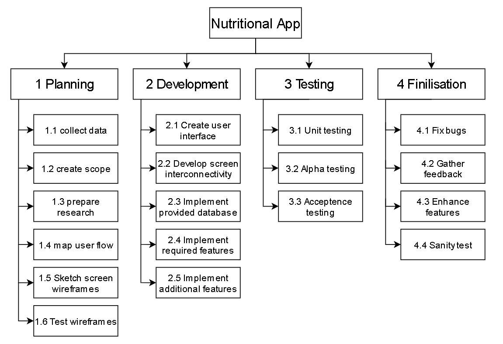
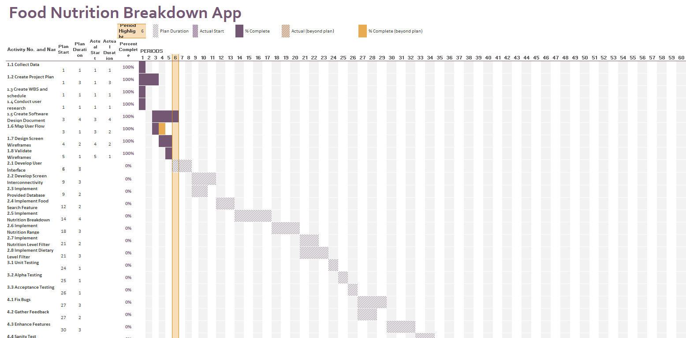
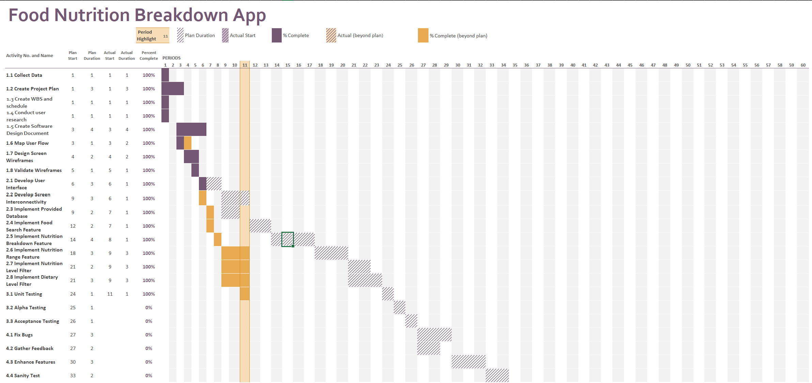

# Project Plan

## Project Name: Food Nutrition Breakdown App
## Group Number: 039

### Team members

| Student No. | Full Name | GitHub Username | Contribution (sum to 100%) | 
|-------------|-----------|-----------------|----------------------------|
| s5340805     | Toby Nilson | Venrin-04             | 40%             |
| s5330262     | Jason Kenaz | Volkowo             | 60%             |             | 

### Brief Description of Contribution
Please Describe what you have accomplished in this group project.
- s5340805, Toby Nilson
  - Participated in the initial meeting set up by Jason to plan the parts of the project we will both undertake.
  - Wrote adnn designed the Work Breakdown Structure and the activity definition estimation for the project plan.
  - Wrote and designed the system requirements section and the user interface section for the software design documement.
  - Gave feedback to Jason throughout the procces as he requested and also revised and fixed parts of my sections baseed on feedback provided by Jason.
      
   Below is my contribution for the 2nd milestone: 
  -  Designed the code to filter the food items with user set conditions.
  -  Tweaked Jason's search code to fit with the filter.
  -  Developed the new wireframes needed
   
  
- s5330262, Jason Kenaz
  - Started the initial meeting with Toby to decide which part each of us will do for both project plan and software design document.
  - Wrote project overview and gantt chart for the project plan.
  - Wrote system vision and software design and software component for software design document.
  - Gave feedback to Toby and also revised my part based on his feedback.   
   Below is my contribution for the 2nd milestone: 
  -  Designed the GUI, search function, and nutrition breakdown for the software. 
  -  Slightly change Toby's code for filter to make it more robust. 
  -  Performed unit testing for every function that is relevant with the main features. 
  -  Wrote coverage testing report and unit testing report. 

# Table of Contents

* [Project Plan](#project-plan)
  * [1. Project Overview](#1-project-overview)
    * [1.1 Project Objectives](#11-project-objectives)
    * [1.2 Project Stakeholders](#12-project-stakeholders)
    * [1.3 Project Scope](#13-project-scope)
  * [2. Work Breakdown Structure](#2-work-breakdown-structure)
  * [3. Activity Definition Estimation](#3-activity-definition-estimation)
  * [4. Gantt Chart](#4-gantt-chart)

## 1. Project Overview

### 1.1 Project Objectives
<!-- Establish objectives or goals that the project aims to achieve. -->
1. **Develop Data Analysis and Visualization Tool** \
Create a tool that allows data analysis and visualization for both good and nutritional information, which enables user to gain insight into various foods' nutritional content.
2. **Advanced Food Filtering** \
Provide users the ability to filter foods based on minimum and maximum nutritional values or by predefined nutritional content levels.
3. **Facilitate Dietary Needs** \
Streamline the diet-planning process by providing feature that allow users to filter foods based on specific dietary needs.

### 1.2 Project Stakeholders
<!-- Identify all key stakeholders involved in the project, including internal teams and potential end-users. -->
1. **Project Sponsor**\
Project sponsor ensures that the project aligns with the company's vision, goals, and strategy.
2. **Project Manager**\
The project manager manages the overall process, ensuring that the project is completed on timw while achieving all the main objectives.
3. **Software Developers and UI/UX Designers**\
Software developers and UI/UX designers ensure smooth development and implementation of the tool in order to minimize technical issues.
4. **Nutrisionist and Dietitians**\
As the dataset provided for this project comes from an external source, it is crucial to get opinions from certified nutritionists and dietitians to ensure the accuracy of the database.\
They are also one of the end-users as they can utilize the tool to analyze and visualize nutritional information for various foods.
5. **Regulatory Bodies**\
Ensures that the project and tool comply with relevant regulations and standards, such as FDA guidelines.
6. **Individuals with Dietary Needs**\
Users that have specific diets, due to reason such as disease, allergies, or personal preferences, can use the tool to track their nutritional intake and make informed food choices.
7. **Caregivers**\
Caregivers can use the tool to ensure that the meals they prepare for their patients meet the nutritional requirements.
8. **Chefs**\
Chefs can utilize the tool to create or plan meals with specific nutritional goals in mind.

### 1.3 Project Scope
<!-- Define and manage what is included or excluded in the project and product. -->
- Ensure that the project and tool complies with the relevant regulations and standards.
- Ensure that the tool have all of the required functionalities before the deadline..
- Design and develop a user-friendly interface in order to enhance the overall user experience.
- Cost modelling, breakdown of costings for implementation and maintenance, and customer support are out of this project's scope.

## 2. Work Breakdown Structure

<!-- Include the Work Breakdown Structure (WBS) for the entire project. WBS should be presented as a hierarchical diagram. Use the elements from the WBS to define activities in Section 3, and schedule these activities in the Gantt Chart in Section 4. Ensure all project activities are considered and included in the WBS. -->

## 3. Activity Definition Estimation

<!-- Define the activities required for your project based on the WBS, and assign responsibilities to team members. Each activity should be numbered and correspond with your Gantt chart. Provide estimated durations for each activity to facilitate Gantt chart preparation. -->

| Activity #No |          Activity Name          | Brief Description | Duration | Responsible Team Members |
|--------------|---------------------------------|-------------------|----------|--------------------------|
| 1.1          | Collect data                    | Gather information about existing nutrition apps that have data analysis and/or visualization tools in it                | 1 day      | All              |
| 1.2          | Create Project Plan                    | Develop a detailed plan with the project's overview, deliverables, and timeline/schedule             | 3 days      | All                      |
| 1.3          | Create WBS and schedule         | Create work breakdown structure (WBS) in the form of hierarchical diagram to define high-level activities that must be done for the project  | 1 day      | Toby                      |
| 1.4          | Conduct user research           | Collect user needs and preferences from a nutrition app that provides data analysis and visualization tools   | 1 day      | Jason                      |
| 1.5          | Create Software Design Document  | Create a document detailing the overview of the system, users' requirements, the component and specification of the system, and overall system design.   | 4 days      | All                      |
| 1.6          | Map user flow                   | Create a flowchart of how users will interact with the tool    | 1 day      | Toby                     |
| 1.7          | Design screen wireframes        | Sketch the screen wireframes for the user interface                             | 2 days      | Toby                     |
| 1.8          | Validate wireframes             | Test the logic and flow of the wireframes with potential users              | 1 day      | Jason                      |
| 2.1          | Develop user interface                     | Code the final screen designs based on wireframes                               | 3 day      | All                      |
| 2.2          | Develop screen interconnectivity           | Code and connect the screens                      | 3 days     | All                      |
| 2.3          | Implement provided database                | Implement the database into the app     | 2 days     | All                      |
| 2.4          | Implement food search feature              | Develop and implement the search function to retrieve food items and display related data    | 2 days     | All                      |
| 2.5          | Implement nutrition breakdown feature      | Develop and implement the feature to display nutritional breakdowns and visualize it                 | 4 days     | All                      |
| 2.6          | Implement nutrition range feature          | Develop and implement the filter to display foods within specified nutritional values                 | 3 days     | All                      |
| 2.7          | Implement nutrition level filter           | Develop and implement the filter to display foods based on its level of nutritional contents                  | 2 days     | All                      |
| 2.8          | Implement dietary filter features          | Develop and implement the filter for dietary needs |3 days     | All                      |
| 3.1          | Unit testing                               | Perform unit testing on all features                              | 1 day      | All                      |
| 3.2          | Alpha testing                              | Perform alpha testing on the app to find bugs and issues                            | 1 day      | Jason                      |
| 3.3          | Acceptence testing                         | Perform acceptence testing on the app to ensure it meets the defined requirements                       | 1 day      | Toby                     |
| 4.1          | Fix bugs                                   | Fix bugs and issues in the code                                     | 3 days     | Toby                     |
| 4.2          | Gather feedback                            | Gather feedback from users and stakeholders from the testing                    | 2 days     | Jason                      |
| 4.3          | Enhance features                           | Enhance the features based on feedback and add additional dietary filters if possible.                   | 3 days     | Toby                     |
| 4.4          | Sanity test                                | Conduct sanity testing to ensure no new bugs were introduced         | 2 days     | Jason                      |

## 4. Gantt Chart
Below is the gantt chart for this project based on the WBS and activity estimation. "Actual start", "Actual duration", and "Percent completition" have also been filled for activities that are currently finished.
<!-- You have to use the provided Gantt chart template.  

Use the provided Gantt chart template to list all items from the Activity Definition along with relevant estimates 
and scheduling. Ensure that the Gantt chart reflects the activity definitions from Section 3. Track actual start 
times and durations. Besides including Gantt chart here, you should also submit your Gantt chart file separately. -->

 Below is the latest Gantt Chart for this project based on the WBS and activity estimation. As seen below, the development for the software and the initial unit testing was done in periods, which is much faster than the initial duration.

