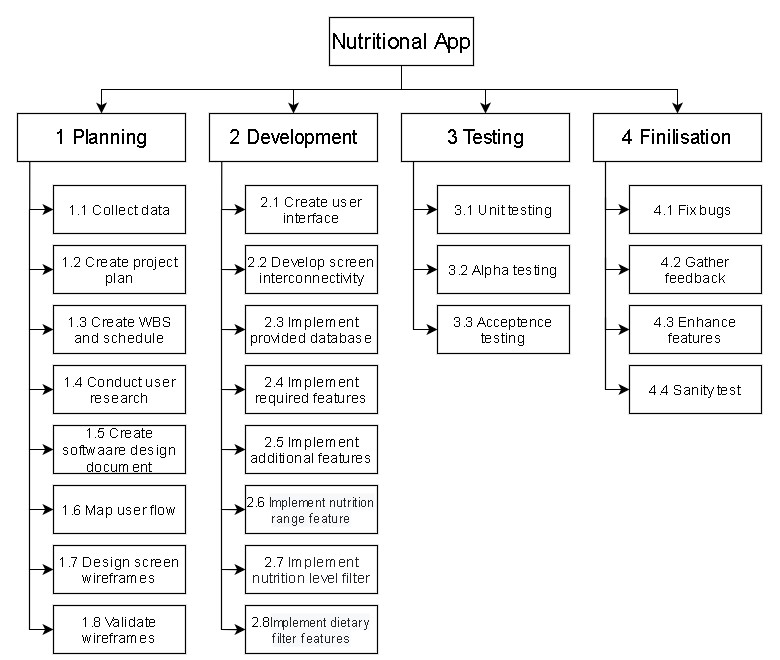

# Project Plan

## Project Name: XXXX
## Group Number: 001

### Team members

| Student No. | Full Name | GitHub Username | Contribution (sum to 100%) | 
|-------------|-----------|-----------------|----------------------------|
| s5340805     | Toby Nilson | Venrin-04             | 33.3% or Equal             |
| s5330161     | Jason Kenaz | Volkowo             | 33.3% or Equal             | 

### Brief Description of Contribution

Please Describe what you have accomplished in this group project.
- s111111, Full name
  - Accomplishments: Describe what you have completed or achieved
- s222222, Full name
  - Accomplishments: Describe what you have completed or achieved

# Table of Contents

* [Project Plan](#project-plan)
  * [1. Project Overview](#1-project-overview)
    * [1.1 Project Objectives](#11-project-objectives)
    * [1.2 Project Stakeholders](#12-project-stakeholders)
    * [1.3 Project Scope](#13-project-scope)
  * [2. Work Breakdown Structure](#2-work-breakdown-structure)
  * [3. Activity Definition Estimation](#3-activity-definition-estimation)
  * [4. Gantt Chart](#4-gantt-chart)

## 1. Project Overview

### 1.1 Project Objectives
<!-- Establish objectives or goals that the project aims to achieve. -->
1. **Develop Data Analysis and Visualization Tool** \
Create a tool that allows data analysis and visualization for both good and nutritional information, which enables user to gain insight into various foods' nutritional content.
2. **Advanced Food Filtering** \
Give users the ability to filter foods based on minimum and maximum nutritional values or by predefined nutritional content levels. This feature help users find foods that meet certain dietary requirement.
3. **Facilitate Diet Planning** \
Streamline the process of diet planning by having features that allow users to plan their diet.

### 1.2 Project Stakeholders

Identify all key stakeholders involved in the project, including internal teams and potential end-users.

### 1.3 Project Scope

Define and manage what is included or excluded in the project and product.

## 2. Work Breakdown Structure

Include the Work Breakdown Structure (WBS) for the entire project. WBS should be presented as a hierarchical diagram. Use the elements from the WBS to define activities in Section 3, and schedule these activities in the Gantt Chart in Section 4. Ensure all project activities are considered and included in the WBS.

## 3. Activity Definition Estimation

Define the activities required for your project based on the WBS, and assign responsibilities to team members. Each activity should be numbered and correspond with your Gantt chart. Provide estimated durations for each activity to facilitate Gantt chart preparation.

| Activity #No | Activity Name | Brief Description | Duration | Responsible Team Members |
|--------------|---------------|-------------------|----------|--------------------------|
| xxx          | xxx           | xxx               | xxx      | xxx \& yyy               |
| xxxx         | xxx           | xxx               | xxx      | All                      |
| xxxx         | xxx           | xxx               | xxx      | xxx                      |

## 4. Gantt Chart
You have to use the provided Gantt chart template.  

Use the provided Gantt chart template to list all items from the Activity Definition along with relevant estimates 
and scheduling. Ensure that the Gantt chart reflects the activity definitions from Section 3. Track actual start 
times and durations. Besides including Gantt chart here, you should also submit your Gantt chart file separately.

