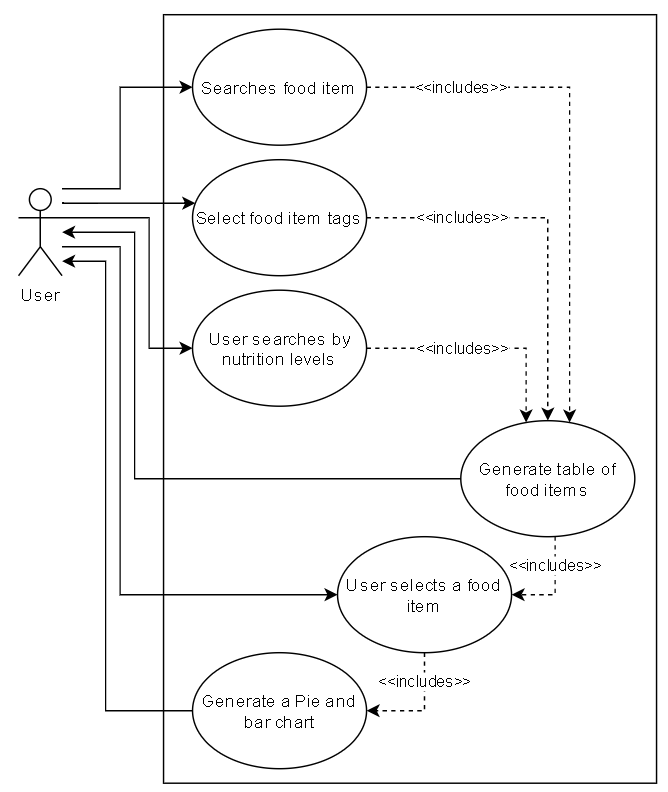
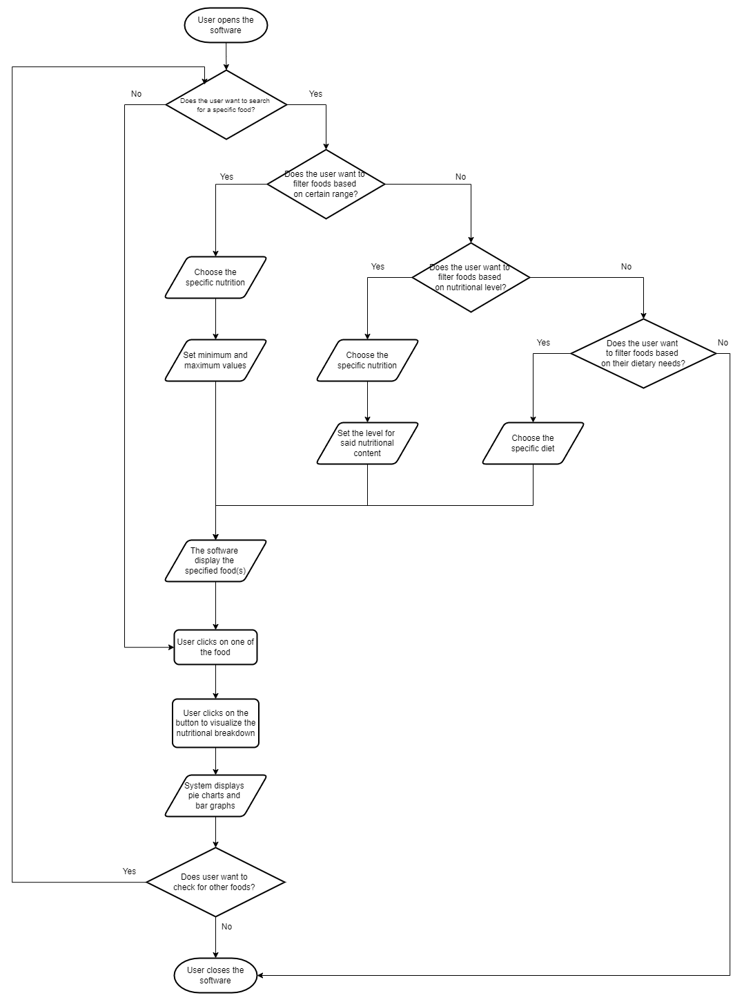
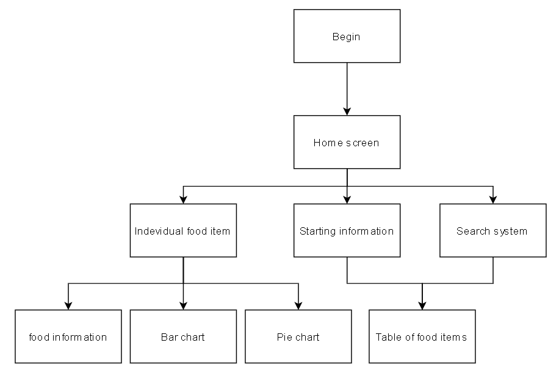
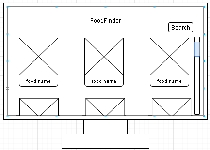
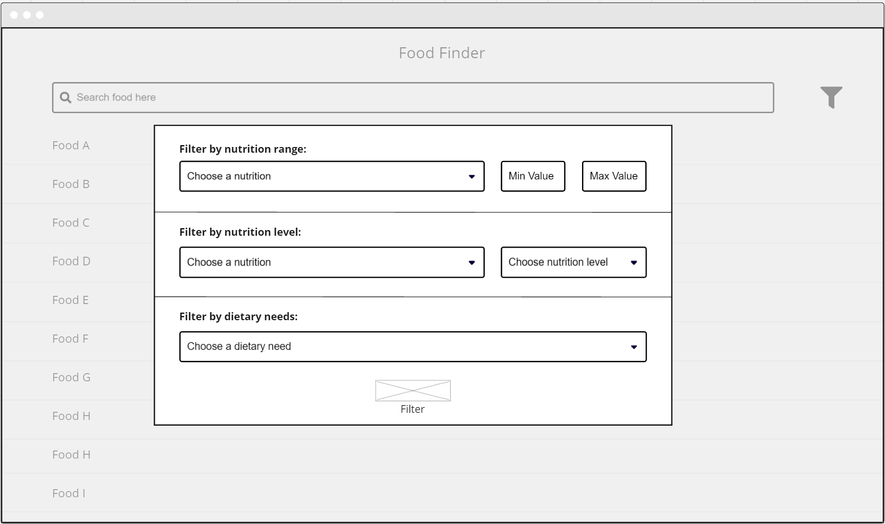

# Software Design Document

## Project Name: XXXX
## Group Number: 039

## Team members

| Student Number | Name      | 
|----------------|-----------|
| s5340805        | Toby Nilsson |
| s5330262        | Jason Kenaz | 

# Table of Contents

<!-- TOC -->
* [Table of Contents](#table-of-contents)
  * [1. System Vision](#1-system-vision)
    * [1.1 Problem Background](#11-problem-background)
    * [1.2 System capabilities/overview](#12-system-capabilitiesoverview)
    * [1.3	Potential Benefits](#13potential-benefits)
  * [2. Requirements](#2-requirements)
    * [2.1 User Requirements](#21-user-requirements)
    * [2.2	Software Requirements](#22software-requirements)
    * [2.3 Use Case Diagrams](#23-use-case-diagrams)
    * [2.4 Use Cases](#24-use-cases)
  * [3.	Software Design and System Components](#3-software-design-and-system-components-)
    * [3.1	Software Design](#31software-design)
    * [3.2	System Components](#32system-components)
      * [3.2.1 Functions](#321-functions)
      * [3.2.2 Data Structures / Data Sources](#322-data-structures--data-sources)
      * [3.2.3 Detailed Design](#323-detailed-design)
  * [4. User Interface Design](#4-user-interface-design)
    * [4.1 Structural Design](#41-structural-design)
    * [4.2	Visual Design](#42visual-design)
<!-- TOC -->

### 1.1 Problem Background
<!-- - Problem Identification: What problem does this system solve?
- Dataset: What is the dataset used?
- Data Input/Output: What kind of data input and output is required?
- Target Users: Who will use the system, and why? -->
- Problem Identification\
The problem addressed by this tool is the lack of comprehensive tools that integrate both analysis and visualization of nutritional information for a wide range of foods. The purpose of this tool is to combine both functionalities efficiently so that the users can get valuable insights from nutritional data.
- Dataset\
The dataset for this project is provided by the client in the ".csv" file format. It provides detailed nutritional information for a wide range of common food items. These information provide critical data that can help in understanding the nutritional content of various foods.
- Data\
<!-- TO DO: Don't forget to add this later -->
- Target Users
  - **People with Specific Dietary Needs**\
  Individuals with dietary restrictions because of disease, allergies, or personal preferences can utilize the tool to track their nutritional intake and plan their diets.
  - **Nutritionist and Dietitians**\
  These professionals can utilize the tool to analyze and visualize the nutritional breakdown of various foods either for their clients or research purposes.
  - **Researchers**\
  Researchers can apply the tool for nutritional studies, helping them identify correlations between dietary habits and health markers in order to research how certain nutrients can affect an individual's health.  
In summary, the system provides detailed analysis, visualization, and filtering functionalities for anyone interested in dietary, health and medical research. The primary goal of this tool is to offer insights that support better dietary decisions and health outcomes.

### 1.2 System capabilities/overview
- System Functionality\
The tool will let users search for foods by name and break down their nutritional information through visualizations. These visualizations come in the form of pie charts and bar graphs. The search function will also include filters that enable users to find foods based on defined nutritional ranges, specific levels of nutritional content, and/or specific dietary needs (e.g., ketogenic diet, low sodium, low cholesterol) to facilitate diet planning.
- Features and Functionalities\
<!-- Describe the key features and functionalities of the system. -->
1. **Food Search**\
Enable users to search for foods by name and display all the nutritional information;
2. **Nutrition Breakdown**\
Enable users to select one food, and display pie charts & bar graphs showing the breakdown of different nutrients for the selected food.
3. **Nutrition Range Filter**\
Enable users to select one of nutrition and input minimum & maximum values, and the tool will display a list of foods that fall within those ranges.
4. **Nutrition Level Filter**\
Enable users to filter foods by nutritional content levels—low, mid, and high—including fat, protein, carbohydrates, sugar, and nutritional density. The three levels are defined as follows:
- Low: Less than 33% of the highest value.
- Mid: Between 33% and 66% of the highest value.
- High: Greater than 66% of the highest value.
5. **Dietary Filter**\
Enable users to filter foods based on the three dietary needs that the software have provided. The three dietary needs are: keto, low-sodium, and low-cholesterol diet. The requirements for these dietary needs are defined as follow:
- Ketogenic (Keto) Diet \
Low in carbohydrates, which is less than 5-10% of caloric intake.
- Low Sodium Diet \
Foods with low sodium content, which usually is less than 140mg per serving.
- Low Cholesterol Diet \
Low cholestrol foods that have less than 20mg per serving. \
Additional dietary needs will be added if the system can be finished before the due date.

### 1.3	Benefit Analysis
<!-- How will this system provide value or benefit? -->
- The system assists users in meal preparation based on their dietary needs with the help of the in-depth filters. This leads to a more personalized nutrition management for each user as they can plan their diet and food choices through the provided filters.
- Advanced filtering options enable users to quickly find foods that meet their dietary needs and/or nutritional goals, which helps them save time in meal planning and grocery shopping. The dietary filter also helps users in identifying foods that are suitable to their diet.
- The system helps users make informed decision about their food choices through detailed nutritional data and visualizations.
- Nutritional breakdowns can also be presented in visual formats, such as pie charts and bar graphs, to help users in understanding key information through a format that is more understandable and digestible.

## 2. Requirements

### 2.1 User Requirements - 
Due to the nature of this type of system there can be a variety of different people that could use it but as stated previously the main 3 that are focused on are people with specific dietary needs, nutritionists/ dietitians, and researchers. To fit the needs of all these different groups of people the user requirements are listed below. 
- Display a list of food items and their nutritional information.
- Allow the user to search for specific food items.
- Allow the user to select tags to filter the types of food items.
- Display more detailed information based on a food item.
- Allow the user to search for food items by nutrition levels.

### 2.2	Software Requirements 
For the system to perform all the requirements stated above the following will be a list of all the requirements that the system will have for the software. 
- The system shall connect to a data base of food items and their nutritional information. 
- The system shall  query data from a database using inputs given by user. 
- The system shall  generate bar and pie charts for nutritional values. 
- The system shall create a table of food items with the information retrieved from the database. 
- The system shall have a connecting system of screens. 

### 2.3 Use Case Diagram

### 2.4 Use Cases

| Use Case ID    | UC-01  |
|----------------|------|
| Use Case Name  | Search food by name |
| Actors         | User |
| Description    | The user Searchs for a food item by its name |
| Flow of Events | 1) the user open the app. 2) the user enters the name of the food item they want. 3) user gets a table of all food items matching the the searched name.|
| Alternate Flow | entered name dosent exist and an error is returned. |

| Use Case ID    | UC-02  |
|----------------|------|
| Use Case Name  | Search food by tag |
| Actors         | User |
| Description    | The user Searchs for a food item by a tag  |
| Flow of Events | 1) the user open the app. 2) the user tag they want. 3) user gets a table of all food items matching the the searched tag. |
| Alternate Flow | user dosent want to search by the tag anymore and clears the search requirements. |

| Use Case ID    | UC-03  |
|----------------|------|
| Use Case Name  | Search food by nutrition level |
| Actors         | User |
| Description    | The user Searchs for a food item by its nutrition level |
| Flow of Events | 1) the user open the app. 2) the user selects to search by nutrition value. 3)The user selects the level of nutrition level. 4) user gets a table of all food items matching the the searched nutrion level. |
| Alternate Flow | user dosent want to search by the tag anymore and clears the search requirements. |

| Use Case ID    | UC-04  |
|----------------|------|
| Use Case Name  | User selects a food item  |
| Actors         | User |
| Description    | The user selects a food item and looks at the nutrition values and further information |
| Flow of Events | 1) The user opens the app. 2) Selects a food item from the table of food items. |
| Alternate Flow | the user searches for a food item before selecting it |

| Use Case ID    | UC-05  |
|----------------|------|
| Use Case Name  | User search and brows |
| Actors         | Useer |
| Description    | the user searches for a food item and looks at its information |
| Flow of Events | 1) User opens the app. 2) rhe user enters the food item name they want. 3) they select the food item from the results. 4) the user views the food item info |
| Alternate Flow | xxxx |

## 3.	Software Design and System Components 

### 3.1	Software Design

### 3.2	System Components

#### 3.2.1 Functions
<!-- List all key functions within the software. For each function, provide:
- Description: Brief explanation of the function’s purpose.
- Input Parameters: List parameters, their data types, and their use.
- Return Value: Describe what the function returns.
- Side Effects: Note any side effects, such as changes to global variables or data passed by reference. -->
1. **foodSearch()**
- Description: Searches the database for foods that match with user's input and return both the foods' name and nutritional information.
- Input Parameters:
  - foodName: string \
  The user enters the name of the food in the search bar. The string is then used to query through the database to get the foods that have the same string as user's input.
- Return Value: 
  - foodOutput: dict \
  The function returns a dictionary of foods, together with its nurtitional information, that match the user's input.
- Side Effects:
  - No side effects from this function
2. **displayPieChart()**
- Description: Display pie chart showing the breakdown of different nutrients for the food that the user chose.
- Input Parameters:
  - foodName: string\
  The name of the food the user selects. This input will be used to return the corresponding nutritional data from the database.
- Return Value:
  - None for now. Will revise after next week's lecture.
- Side Effects:
  - None for now. Will revise after next week's lecture.
3. **displayBarChart()**
- Description: Display bar chart showing the breakdown of different nutrients for the food that the user chose.
- Input Parameters:
  - foodName: string\
  The name of the food the user selects. This input will be used to return the corresponding nutritional data from the database.
- Return Value:
  - None for now. Will revise after next week's lecture.
- Side Effects:
  - None for now. Will revise after next week's lecture.
4. **filter_nutritionRange()**
- Description: Filters and display list of foods that are within a specified range of minimum & maximum values of a chosen nutrient. Users will select a nutrient and define the minimum and maximum value. The function will then search through the database to find foods that meet these criteria.
- Input Parameters:
  - nutritionName: string\
  The name of the nutrition to filter by.
  - minVal: float\
  The minimum value of the nutrition value that the food must meet.
  - maxVal: float\
  The maximum value of the nutrition value that the food must meet. \
- Return Value:
    - foodOutput: dict \
  The function returns a dictionary of foods, together with its nurtitional information, that match the user's input.
- Side Effects:
  - No side effects from this function.
5. **Nutrition Level Filter**
- Description: Enable users to filter foods by nutritional content levels—low, mid, and high—including fat, protein, carbohydrates, sugar, and nutritional density. The three levels are defined as follows:
  - Low: Less than 33% of the highest value.
  - Mid: Between 33% and 66% of the highest value.
  - High: Greater than 66% of the highest value.
- Input Parameters:
- Return Value:
- Side Effects:
6. **Dietary Filter**
- Description: Enable users to filter foods based on the three dietary needs that the software have provided. The three dietary needs are: keto, low-sodium, and low-cholesterol diet. The requirements for these dietary needs are defined as follow:
  - Ketogenic (Keto) Diet \
  Low in carbohydrates, which is less than 5-10% of caloric intake.
  - Low Sodium Diet \
  Foods with low sodium content, which usually is less than 140mg per serving.
  - Low Cholesterol Diet \
  Low cholestrol foods that have less than 20mg per serving. \
  Additional dietary needs will be added if the system can be finished before the due date.
- Input Parameters:
- Return Value:
- Side Effects:

#### 3.2.2 Data Structures / Data Sources
List all data structures or sources used in the software. For each, provide:

- Type: Type of data structure (e.g., list, set, dictionary).
- Usage: Describe where and how it is used.
- Functions: List functions that utilize this structure.

#### 3.2.3 Detailed Design
Provide pseudocode or flowcharts for all functions listed in Section 3.2.1 that operate on data structures. For instance, include pseudocode or a flowchart for a custom searching function.

## 4. User Interface Design

### 4.1 Structural Design  

### 4.2	Visual Design
<!--Include all wireframes or mock-ups of the interface. Provide a discussion, explanation, and justification for your design choices. Hand-drawn wireframes are acceptable.

- Interface Components: Clearly label all components.
- Screens/Menus: Provide wireframes for different screens, menus, and options.
- Design Details: Focus on the layout and size of components; color and graphics are not required. 

Example:  -->

