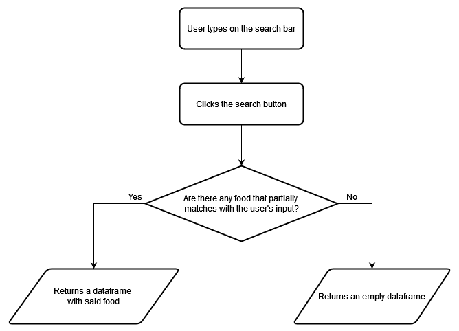
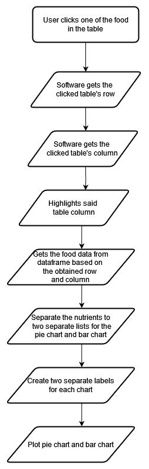
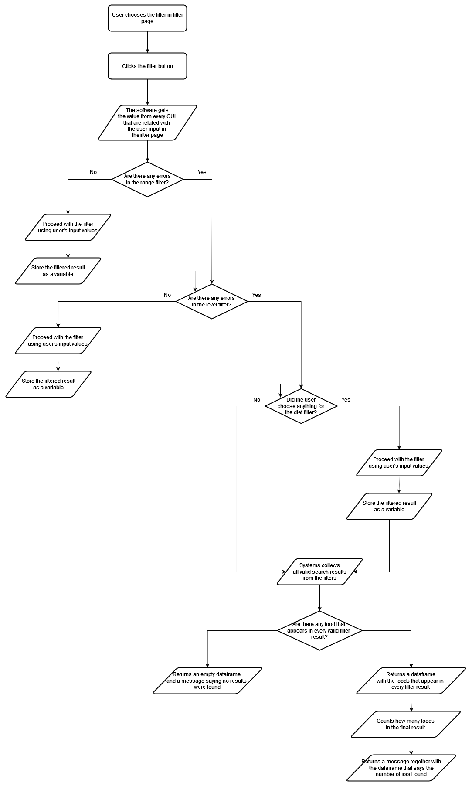
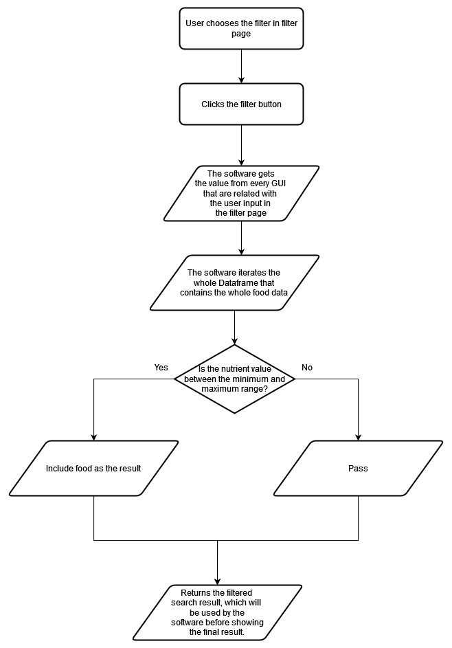
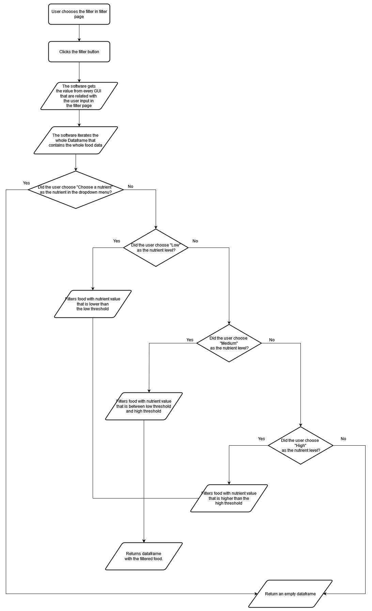
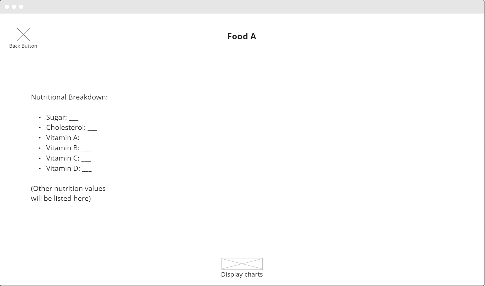
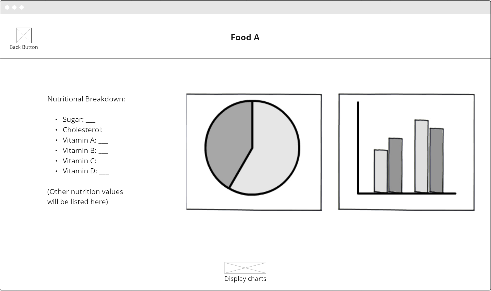
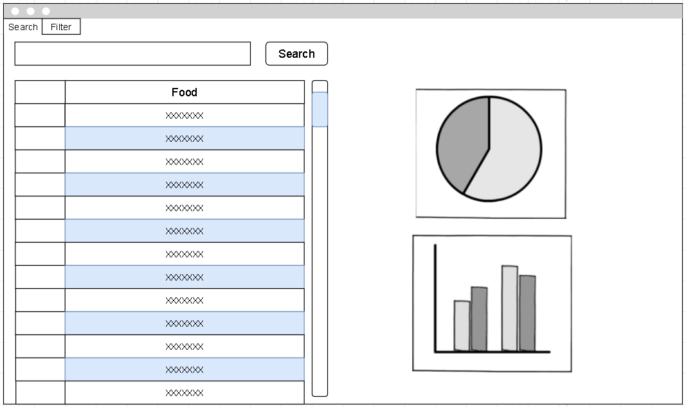
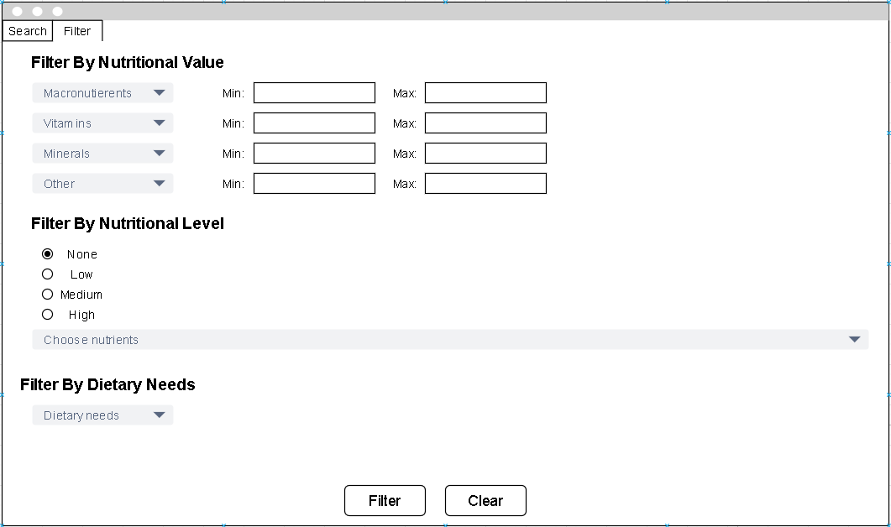

# Software Design Document

## Project Name: Food Nutrition Breakdown App
## Group Number: 039

## Team members

| Student Number | Name      | 
|----------------|-----------|
| s5340805        | Toby Nilsson |
| s5330262        | Jason Kenaz | 

# Table of Contents

<!-- TOC -->
* [Table of Contents](#table-of-contents)
  * [1. System Vision](#1-system-vision)
    * [1.1 Problem Background](#11-problem-background)
    * [1.2 System capabilities/overview](#12-system-capabilitiesoverview)
    * [1.3	Potential Benefits](#13potential-benefits)
  * [2. Requirements](#2-requirements)
    * [2.1 User Requirements](#21-user-requirements)
    * [2.2	Software Requirements](#22software-requirements)
    * [2.3 Use Case Diagrams](#23-use-case-diagrams)
    * [2.4 Use Cases](#24-use-cases)
  * [3.	Software Design and System Components](#3-software-design-and-system-components-)
    * [3.1	Software Design](#31software-design)
    * [3.2	System Components](#32system-components)
      * [3.2.1 Functions](#321-functions)
      * [3.2.2 Data Structures / Data Sources](#322-data-structures--data-sources)
      * [3.2.3 Detailed Design](#323-detailed-design)
  * [4. User Interface Design](#4-user-interface-design)
    * [4.1 Structural Design](#41-structural-design)
    * [4.2	Visual Design](#42visual-design)
<!-- TOC -->

### 1.1 Problem Background
<!-- - Problem Identification: What problem does this system solve?
- Dataset: What is the dataset used?
- Data Input/Output: What kind of data input and output is required?
- Target Users: Who will use the system, and why? -->
- Problem Identification\
The problem addressed by this tool is the lack of comprehensive tools that integrate both analysis and visualization of nutritional information for a wide range of foods. The purpose of this tool is to combine both functionalities efficiently so that the users can get valuable insights from nutritional data.
- Dataset\
The dataset for this project is provided by the client in the ".csv" file format. It provides detailed nutritional information for a wide range of common food items. These information provide critical data that can help in understanding the nutritional content of various foods.
- Data
  - Data Input
    - User input: User's input from the search bar.
    - User's preference: Stores user's filter choices at the system so it remember's the users' preference throughout the session.
  - Data Output
    - List of food: List of foods based on the data that was given. The list of foods can change depending on users' input and filter choices.
    - Nutritional breakdown: List of nutritional values that will be displayed when the user clicks on a food name.
    - Pie Chart: Visualized version of the nutritional breakdown in the form of pie chart.
    - Bar Chart: Visualized version of the nutritional breakdown in the form of bar chart.
- Target Users
  - **People with Specific Dietary Needs**\
  Individuals with dietary restrictions because of disease, allergies, or personal preferences can utilize the tool to track their nutritional intake and plan their diets.
  - **Nutritionist and Dietitians**\
  These professionals can utilize the tool to analyze and visualize the nutritional breakdown of various foods either for their clients or research purposes.
  - **Researchers**\
  Researchers can apply the tool for nutritional studies, helping them identify correlations between dietary habits and health markers in order to research how certain nutrients can affect an individual's health.  
In summary, the system provides detailed analysis, visualization, and filtering functionalities for anyone interested in dietary, health and medical research. The primary goal of this tool is to offer insights that support better dietary decisions and health outcomes.

### 1.2 System Capabilities/overview
- System Functionality\
The tool will let users search for foods by name and break down their nutritional information through visualizations. These visualizations come in the form of pie charts and bar graphs. The search function will also include filters that enable users to find foods based on defined nutritional ranges, specific levels of nutritional content, and/or specific dietary needs (e.g., ketogenic diet, low sodium, low cholesterol) to facilitate diet planning.
- Features and Functionalities
  - **Food Search**\
  Enable users to search for foods by name and display all the nutritional information;
  - **Nutrition Breakdown**\
  Enable users to select one food, and display pie charts & bar graphs showing the breakdown of different nutrients for the selected food.
  - **Nutrition Range Filter**\
  Enable users to select one of nutrition and input minimum & maximum values, and the tool will display a list of foods that fall within those ranges.
  - **Nutrition Level Filter**\
  Enable users to filter foods by nutritional content levels—low, mid, and high—including fat, protein, carbohydrates, sugar, and nutritional density. The three levels are defined as follows:
    - Low: Less than 33% of the highest value.
    - Mid: Between 33% and 66% of the highest value.
    - High: Greater than 66% of the highest value.
  - **Dietary Filter**\
  Enable users to filter foods based on the three dietary needs that the software have provided. The three dietary needs are: keto, low-sodium, and low-cholesterol diet. The requirements for these dietary needs are defined as follow:
    - Ketogenic (Keto) Diet \
    Low in carbohydrates, which is less than 5-10% of caloric intake.
    - Low Sodium Diet \
    Foods with low sodium content, which usually is less than 140mg per serving.\
     The condition has been changed to from less than 140mg per serving to 40mg per serving. This is because every food in the `.csv` file falls under the initial condition. 
    - Low Cholesterol Diet \
    Low cholestrol foods that have less than 20mg per serving. \
  Additional dietary needs will be added if the system can be finished before the due date.

### 1.3	Benefit Analysis
<!-- How will this system provide value or benefit? -->
- The system assists users in meal preparation based on their dietary needs with the help of the in-depth filters. This leads to a more personalized nutrition management for each user as they can plan their diet and food choices through the provided filters.
- Advanced filtering options enable users to quickly find foods that meet their dietary needs and/or nutritional goals, which helps them save time in meal planning and grocery shopping. The dietary filter also helps users in identifying foods that are suitable to their diet.
- The system helps users make informed decision about their food choices through detailed nutritional data and visualizations.
- Nutritional breakdowns can also be presented in visual formats, such as pie charts and bar graphs, to help users in understanding key information through a format that is more understandable and digestible.

## 2. Requirements

### 2.1 User Requirements 
Due to the nature of this type of system, there can be a variety of different people that can use it. But as stated previously, the main user targets are people with specific dietary needs, nutritionists/ dietitians, and researchers. To fit the needs of all these different groups of people the user requirements are listed below. 
- Display a list of food items and their nutritional information.
- Allow the users to search for specific food items.
- Allow the users to select tags to filter the types of food items.
- Display detailed information based on a food item.
- Allow the users to search for food items by nutrition levels.

### 2.2	Software Requirements 
For the system to perform all the requirements stated above the following will be a list of all the requirements that the system will have for the software. 
- The system shall connect to a data base of food items and their nutritional information. 
- The system shall query data from a database using inputs given by user. 
- The system shall generate bar and pie charts for nutritional values. 
- The system shall create a table of food items with the information retrieved from the database. 
- The system shall have a connecting system of screens. 

### 2.3 Use Case Diagram
Below is the use case diagram it depicts how the users will interact with the system.

### 2.4 Use Cases
The following is a series of different use cases that can happen when a user it to try using this system.

| Use Case ID    | UC-01  |
|----------------|------|
| Use Case Name  | Search Food by Name |
| Actors         | User |
| Description    | The user searches for food by typing in the search bar. |
| Flow of Events | 1. The user opens the app.   2. The user clicks the search button and enter the name of the food item they want to look for.   3. The system searches through the database based on user's input.  4. The system returns a list of food according to user's input.   5. The user gets a table of all food items matching the searched name.|
| Alternate Flow | Entered name does not exist and an error is returned instead by the system. |

| Use Case ID    | UC-02  |
|----------------|------|
| Use Case Name  | Filter Food by Nutrition Range |
| Actors         | User |
| Description    | The user filters foods based on its nutrition range by selecting a nutritient and its maximum and minimum value |
| Flow of Events | 1. The user clicks on the filter button.   2. The user selects a nutritient to filter.   3. The user inputs the minimum and maximum value if said nutrient.   4. The system searches through the database based on user's input.   5. The system returns a list of food according to user's input.   6. The user gets a table of all food items matching the searched name.|
| Alternate Flow | No foods are within user's specified range and an error is returned instead.|

| Use Case ID    | UC-03  |
|----------------|------|
| Use Case Name  | Filter Food by Nutrition Level |
| Actors         | User |
| Description    | The user filters foods based on its nutrition level by selecting a nutrient and choosing one of the nutrition level |
| Flow of Events | 1. The user clicks on the filter button.   2. The user selects a nutritient to filter.   3. The user chooses one out of the three nutrition level.   4. The system searches through the database based on user's input and filter the nutrition content based on the nutrition level that the user chose.   5. The system returns a list of food according to user's input.   6. The user gets a table of all food items matching the searched name.|
| Alternate Flow | No foods contain a nutritient in that range and an error is returned instead. |

| Use Case ID    | UC-04  |
|----------------|------|
| Use Case Name  | Filter Food by Dietary Needs |
| Actors         | User |
| Description    | The user filers foods based on dietary needs by choosing one of out the three dietary options that are provided. |
| Flow of Events | 1. The user clicks on the filter button.   2. The user chooses one out of the three dietary needs.   3. The system searches and filter through the database based on the dietary need that the user chose.   4. The system returns a list of food according to user's input.   5. The user gets a table of all food items matching the searched name.|
| Alternate Flow | No foods that meet the dietary requirement that the user chose and an error is returned instead. |

| Use Case ID    | UC-05  |
|----------------|------|
| Use Case Name  | View Food Item  |
| Actors         | User |
| Description    | The user selects a food item to view the nutrition values and other related information |
| Flow of Events | 1. The user clicks on a food.   2. The system gets every data that are related to said food.   3. The system redirects the user to a different page and display the food with its nutrition values and other related information |
| Alternate Flow | None |

| Use Case ID    | UC-06  |
|----------------|------|
| Use Case Name  | View Charts |
| Actors         | User |
| Description    | The user clicks on a button that will display both pie and bar charts to visualize the nutrition values of a food |
| Flow of Events | 1. User chooses a food to view.   2. The system redirects user to a new page where it will display the food and other related information to it.   3. The user clicks on a button to show both pie chart and bar chart.   4. The system shows a pop-up/modal page that shows both pie and bar chart as a way to visualize the nutrition values. |
| Alternate Flow | None |

## 3.	Software Design and System Components 

### 3.1	Software Design

### 3.2	System Components

#### 3.2.1 Functions
<!-- List all key functions within the software. For each function, provide:
- Description: Brief explanation of the function’s purpose.
- Input Parameters: List parameters, their data types, and their use.
- Return Value: Describe what the function returns.
- Side Effects: Note any side effects, such as changes to global variables or data passed by reference. -->
 
1. **searchFood()**
- Description: Searches the database for foods that match with user's input and return both the foods' name and nutritional information.
- Input Parameters:
  - foodName: string \
  The user enters the name of the food in the search bar. The string is then used to query through the database to get the foods that have the same string as user's input.
- Return Value: 
  - foodOutput:  Dataframe  \
  The function returns a dataframe of foods that match the user's input.
- Side Effects:
  -  The table below the search bar will change based on the search result. 
2.  nutritionBreakdown()
- Description: Displays both pie chart and bar chart showing the breakdown of nutrients of the food that the user clicked. Also highlights the column that the user chose.
- Input Parameters:
  - foodName: string\
  The name of the food the user selects. This input will be used to return the corresponding nutritional data from the database.
- Return Value:
  -  Returns both pie and bar chart with the help of mathplotlib. 
- Side Effects:
  -  Both pie and bar chart are displayed directly in the software. 
3.  filterFood()
- Description:  Handles the general error validation for all of the food filters. The functions that do the actual filtering is inside filterFood() as well. For additional context, it is important to note that every nutrient is grouped into one of four categories: Macronutrients, Vitamins, Minerals, and Others.
- Input Parameters:
- macro: string  
  The name of the nutrition the user selects for macronutrient. This is for the nutrient range filter.
- vitamin: string  
  The name of the nutrition the user selects for vitamin. This is for the nutrient range filter.
- mineral: string  
  The name of the nutrition the user selects for mineral. This is for the nutrient range filter.
- other: string  
  The name of the nutrition the user selects for other. This is for the nutrient range filter.
- nutrientLevel: string  
  The level of filter that user chose for nutrient level filter.
- nutrientFilter: string  
  The name of nutrient that the user chose for nutrient level filter.
- minMacro: string  
  The minimum range user has put for macronutrient. This is for the nutrient range filter.
- maxMacro: string  
  The maximum range user has put for macronutrient. This is for the nutrient range filter.
- minVitamin: string  
  The minimum range user has put for vitamin. This is for the nutrient range filter.
- maxVitamin: string  
  The maximum range user has put for vitamin. This is for the nutrient range filter.
- minMineral: string  
  The minimum range user has put for mineral. This is for the nutrient range filter.
- maxMineral: string  
  The maximum range user has put for mineral. This is for the nutrient range filter.
- minOther: string  
  The minimum range user has put for other. This is for the nutrient range filter.
- maxOther: string  
  The maximum range user has put for other. This is for the nutrient range filter.

- Return Value:
  - mergeResult: Dataframe  
  The search result after applying every filter that passed the error validation.
  - searchResultMsg: string  
  A string that shows how many foods were found with said filters.
- Side Effects:
  -  Display searchResultMsg as a label for one of the text..
4. **filterRange()**
- Description: Filters and display list of foods that are within a specified range of minimum & maximum values of a chosen nutrient. Users will select a nutrient and define the minimum and maximum value. The function will then search through the database to find foods that meet these criteria.
- Input Parameters:
  - dropdownNutrient: string  
    The name of the nutrient. The value is obtained from the dropdown menu related to this filter
  - minValue: float  
    The minimum range user has put for the nutrient.
  - maxValue: float  
    The maximum range user has put for the nutrient.
- Return Value:
  - mergeResult_filter: Dataframe  
  The search result after applying the filter. 
- Side Effects:
  - No side effects from this function.
5. **filterLevel()**
- Description: Filters and display list of foods by choosing a nutrient and its content level.
- Input Parameters:
    
    - **maxValueDict**: Dict\
    Contains a collection of the highest value for each nutrient.
    - **dropdownValue**: String\
    The name of the nutrient that is obtained from the dropdown menu.
    - **levelFilter**: String\
    The level for the filter. The value is obtained from the radio button.
    
- Return Value:
  - searchResult_level: Dataframe \
  The function returns a dataframe  of foods that match the user's input.
- Side Effects:
  - No side effects from this function
6. **filterDiet()**
- Description: Filters and display list of foods based on the three tags for dietary needs.
- Input Parameters:
  - dropdownValue: string\
  The dietary needs that the user chose. The value comes from the dropdown menu for this filter.
- Return Value:
  - searchResult_diet: Dataframe \
  The function returns a dataframe  of foods that match the user's input.
- Side Effects:
  - No side effects from this function\  
#### 3.2.2 Data Structures / Data Sources
- **foodNutrition**
  - **Type**:  Dataframe 
  - **Usage**: 
    The main data that is used for this software. This contains the food name and all the nutritional content it have. The nutrition name will be the key, and whatever value inside each nutrition is the value.\
    This data is used to display all the food in the main page, and will also be used to find food that matches the users' input and/or filter as well.
  - **Functions**: foodSearch(), nutritionBreakdown(), filterRange(), filterLevel(), filterDiet()

The only data source the software use is the initial Dataframe called foodNutrition. The other data comes from user input.

<!-- List all data structures or sources used in the software. For each, provide:

- Type: Type of data structure (e.g., list, set, dictionary).
- Usage: Describe where and how it is used.
- Functions: List functions that utilize this structure. -->

#### 3.2.3 Detailed Design
<!-- Provide pseudocode or flowcharts for all functions listed in Section 3.2.1 that operate on data structures. For instance, include pseudocode or a flowchart for a custom searching function. -->
 The pseudocodes have been replaced with flowcharts for easier viewing. 
1.  foodSearch() 

2.  nutritionBreakdown() 

3.  filterFood() 

4.  filterRange() 

5.  filterLevel() 

6.  filterDiet() 

## 4. User Interface Design

### 4.1 Structural Design 
Below is the structural design chart is show how the flow of the page will be as a user moves through the system.

### 4.2	Visual Design
<!--Include all wireframes or mock-ups of the interface. Provide a discussion, explanation, and justification for your design choices. Hand-drawn wireframes are acceptable.

- Interface Components: Clearly label all components.
- Screens/Menus: Provide wireframes for different screens, menus, and options.
- Design Details: Focus on the layout and size of components; color and graphics are not required. 

Example:  -->
This section will include all of the wireframe for the User Interface (UI) components of the system will be made to look.
Below is the first screen the user will see when they open the software. It has a list of food names, search bar, and a filter button to refine users' search result.

Below is the pop-up screen where users can either search/filter for foods by its nutritional content, nutritional level, or based on the users' dietary needs.

Below is how the screen will look like when the user clicks on one of the food. It will display all of the nutritional breakdown. There is a button at the bottom where the user can click to display both pie and bar charts.

This is how the screen will look after the user clicks on the button that will display the charts.

The following covers the changes that were made to the wireframes for the project. We did major changes to our design as the initial one was made before we were introduced to wxFormBuilder.
Below is the first page and it shows a list of food names. The page also has a search bar along with a open space that display a pie chart and a bar graph when a food item is selected.	

Next is the second page and it has several filter options to select from. The filters will filter down the selection of food names shown in the table. These options are:
- Four collections of nutrients with min and max range, 
- A filter that filters food based on a nutrient's level of content,
- Dietary needs that filters food based on certain condition.

